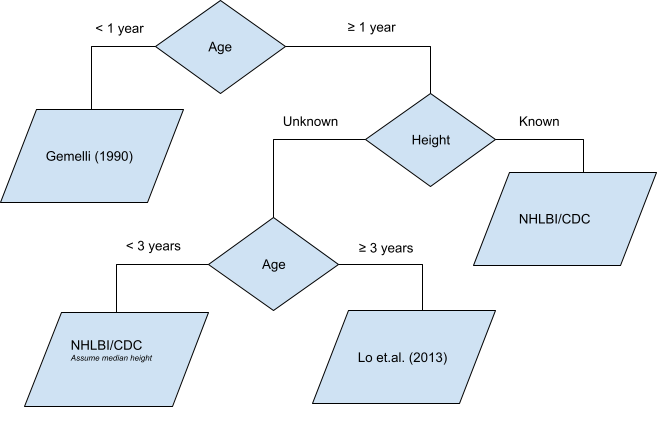

# pedbp : Pediatric Blood Pressure
A R package for estimating expected blood pressure of children and adolescences

[](https://www.repostatus.org/#active)
[](https://github.com/dewittpe/pedbp/actions/workflows/R-CMD-check.yaml)
[](https://app.codecov.io/gh/dewittpe/pedbp)

<!-- Comment out until this package is on CRAN
[](https://cran.r-project.org/package=pedbp)
[](http://www.r-pkg.org/pkg/pedbp)
[](http://www.r-pkg.org/pkg/pedbp)
-->

[](https://www.gnu.org/licenses/old-licenses/gpl-2.0.html)
[](https://cran.r-project.org/)

## Objective
Provided a method for translating pediatric blood pressures, dependent on age,
sex, and height (if known), to percentiles.

## Method
Blood pressure precentiles are based Gaussian distributions defined by published
values for the mean and standard deviation, or derived mean and standard
deviations based on published percentiles.



## How to Install

Install the developmental version:
```{r, eval = FALSE}
remotes::install_github("dewittpe/pedbp", dependencies = TRUE)
```

## Tools

### Blood Pressure Distribution and Quantile Functions

Inputs for these functions are:

* age: in months _required_
* male: indicator for for sex; 0 = female, 1 = male, _required_
* height: in centimeters, _if known_
* sbp,dbp: blood pressure, in mmHg _if known_

```{r}
d <- read.csv(system.file("example_data", "for_batch.csv", package = "pedbp"))
d
# distribution function
p_bp(  q_sbp  = d$sbp..mmHg.
     , q_dbp  = d$dbp..mmHg.
     , age    = d$age_months
     , male   = d$male
     , height = d$height..cm.
     )

# quantile function
q_bp(  p_sbp = 0.50
     , p_dbp = 0.40
     , age   = 96
     , male  = 1)
```

You may also get plots showing where an observed blood pressure is on the
distribution curve
```{r, label = "bp_cdf_example", fig.width = 4, fig.height = 4, fig.path = "inst/images/"}
bp_cdf(  sbp = 105
       , dbp = 59
       , age   = 96
       , male  = 1)
```

More examples and details for the blood pressure distribution functions, along
with additional features such as CDC growth charts, can be found in the package
vignette.
```{r, eval = FALSE}
vignette("bp-distributions", package = "pedbp")
```

### Shiny Application
You may use an interactive [Shiny](https://shiny.rstudio.com/) application as
well.  Assuming you have installed the pedbp package along with the suggested
packages then you can run the app locally via
```{r, eval = FALSE}
shiny::runApp(system.file("shinyapps", package = "pedbp"))
```

## References

* EXPERT PANEL ON INTEGRATED GUIDELINES FOR CARDIOVASCULAR HEALTH AND RISK REDUCTION IN CHILDREN AND ADOLESCENTS. 2011. “Expert Panel on Integrated Guidelines for Cardiovascular Health and Risk Reduction in Children and Adolescents: Summary Report.” Pediatrics 128 (Supplement_5): S213–56. https://doi.org/10.1542/peds.2009-2107C.

* Gemelli, M, R Manganaro, C Mami, and F De Luca. 1990. “Longitudinal Study of Blood Pressure During the 1st Year of Life.” European Journal of Pediatrics 149 (5): 318–20.

* Lo, Joan C, Alan Sinaiko, Malini Chandra, Matthew F Daley, Louise C Greenspan, Emily D Parker, Elyse O Kharbanda, et.al. 2013. “Prehypertension and Hypertension in Community-Based Pediatric Practice.” Pediatrics 131 (2): e415–24.

* Martin, Blake, Peter E. DeWitt, Scout HF, SK Parker, and Tellen D. Bennett. 2022. “Machine Learning Approach to Predicting Absence of Serious Bacterial Infection at PICU Admission.” Hospital Pediatrics.

