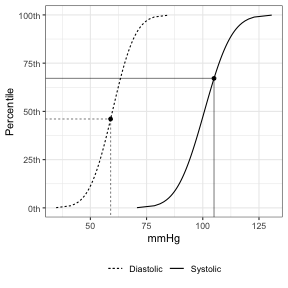

# pedbp : Pediatric Blood Pressure
An R package for estimating expected blood pressure of children and adolescences

[](https://www.repostatus.org/#active)
[](https://github.com/dewittpe/pedbp/actions/workflows/R-CMD-check.yaml)
[](https://app.codecov.io/gh/dewittpe/pedbp)

[](https://cran.r-project.org/package=pedbp)
[](https://www.r-pkg.org/pkg/pedbp)
[](https://www.r-pkg.org/pkg/pedbp)

[](https://www.gnu.org/licenses/old-licenses/gpl-2.0.html)
[](https://cran.r-project.org/)

## Objective
Provide a method for translating pediatric blood pressures, dependent on age,
sex, and height (if known), to percentiles.

## Publications

If you use this package in your research please cite it via:

Martin B, DeWitt PE, Albers D, Bennett TD. Development of a Pediatric Blood
Pressure Percentile Tool for Clinical Decision Support. JAMA Netw Open.
2022;5(10):e2236918. doi:10.1001/jamanetworkopen.2022.36918


```r
citation("pedbp")
```

```
## To cite pedbp please cite the research letter
## 
##   Martin B, DeWitt PE, Albers D, Bennett TD. Development of a Pediatric
##   Blood Pressure Percentile Tool for Clinical Decision Support. JAMA
##   Netw Open. 2022;5(10):e2236918.
##   doi:10.1001/jamanetworkopen.2022.36918
## 
## A BibTeX entry for LaTeX users is
## 
##   @Article{,
##     author = {{Martin} and {Blake} and {DeWitt} and Peter E. and {Albers} and {David} and {Bennett} and Tellen D.},
##     title = {Development of a Pediatric Blood Pressure Percentile Tool for Clinical Decision Support},
##     journal = {JAMA Network Open},
##     volume = {5},
##     number = {10},
##     pages = {e2236918-e2236918},
##     year = {2022},
##     month = {10},
##     issn = {2574-3805},
##     doi = {10.1001/jamanetworkopen.2022.36918},
##     url = {https://doi.org/10.1001/jamanetworkopen.2022.36918},
##     eprint = {https://jamanetwork.com/journals/jamanetworkopen/articlepdf/2797401/martin_2022_ld_220236_1665075001.39453.pdf},
##   }
```

## Method
Blood pressure percentiles are based on Gaussian distributions defined by published
values for the mean and standard deviation, or derived mean and standard
deviations based on published percentiles.


## How to Install

Install from CRAN:


```r
install.packages("pedbp")
```

Install the developmental version:

```r
remotes::install_github("dewittpe/pedbp", dependencies = TRUE)
```

## Tools

### Blood Pressure Distribution and Quantile Functions

Inputs for these functions are:

* age: in months, _required_
* male: indicator for for sex; 0 = female, 1 = male, _required_
* height: in centimeters, _if known_
* sbp,dbp: systolic and diastolic blood pressure in mmHg, _if known_


```r
d <- read.csv(system.file("example_data", "for_batch.csv", package = "pedbp"))
d
```

```
##           pid age_months male height..cm. sbp..mmHg. dbp..mmHg.
## 1   patient_A         96    1          NA        102         58
## 2   patient_B        144    0         153        113         NA
## 3   patient_C          4    0          62         82         43
## 4 patient_D_1         41    1          NA         96         62
## 5 patient_D_2         41    1         101         96         62
```

```r
# distribution function
p_bp(  q_sbp  = d$sbp..mmHg.
     , q_dbp  = d$dbp..mmHg.
     , age    = d$age_months
     , male   = d$male
     , height = d$height..cm.
     )
```

```
## $sbp_percentile
## [1] 0.5533069 0.7680539 0.2622697 0.6195685 0.6101919
## 
## $dbp_percentile
## [1] 0.4120704        NA 0.1356661 0.8028518 0.9011250
## 
## attr(,"bp_params")
##          source male age  sbp_mean   sbp_sd dbp_mean   dbp_sd height_percentile
## 252      lo2013    1  96 100.70000  9.70000 59.80000  8.10000                NA
## 89        nhlbi    0 144 105.00094 10.92093 61.99818 10.94217                50
## 2   gemelli1990    0   3  89.00000 11.00000 54.00000 10.00000                NA
## 247      lo2013    1  36  93.20000  9.20000 55.10000  8.10000                NA
## 146       nhlbi    1  36  93.00921 10.68829 47.00316 11.64362                75
## attr(,"class")
## [1] "pedbp_bp"
```

```r
# quantile function
q_bp(  p_sbp = 0.50
     , p_dbp = 0.40
     , age   = 96
     , male  = 1)
```

```
## $sbp
## [1] 100.7
## 
## $dbp
## [1] 57.74789
## 
## attr(,"bp_params")
##     source male age sbp_mean sbp_sd dbp_mean dbp_sd height_percentile
## 252 lo2013    1  96    100.7    9.7     59.8    8.1                NA
## attr(,"class")
## [1] "pedbp_bp"
```

Plots show where an observed blood pressure is on the distribution curve

```r
bp_cdf(  sbp = 105
       , dbp = 59
       , age   = 96
       , male  = 1)
```



More examples and details for the blood pressure distribution functions, along
with additional features such as CDC growth charts, can be found in the package
vignette.

```r
vignette("bp-distributions", package = "pedbp")
```

### Shiny Application
An interactive [Shiny](https://shiny.rstudio.com/) application is also available.
After installing the pedbp package and the suggested
packages, you can run the app locally via

```r
shiny::runApp(system.file("shinyapps", "pedbp", package = "pedbp"))
```

The shiny app is also live on [shinyapps.io](https://dewittpe.shinyapps.io/pedbp/)

## References

* Expert Panel On Integrated Guidelines For Cardiovascular Health and Risk Reduction in Children and Adolescents. 2011. “Expert Panel on Integrated Guidelines for Cardiovascular Health and Risk Reduction in Children and Adolescents: Summary Report.” Pediatrics 128 (Supplement_5): S213–56. https://doi.org/10.1542/peds.2009-2107C.

* Gemelli, M, R Manganaro, C Mami, and F De Luca. 1990. “Longitudinal Study of Blood Pressure During the 1st Year of Life.” European Journal of Pediatrics 149 (5): 318–20.

* Lo, Joan C, Alan Sinaiko, Malini Chandra, Matthew F Daley, Louise C Greenspan, Emily D Parker, Elyse O Kharbanda, et.al. 2013. “Prehypertension and Hypertension in Community-Based Pediatric Practice.” Pediatrics 131 (2): e415–24.

* Martin, Blake, Peter E. DeWitt, Scout HF, SK Parker, and Tellen D. Bennett. 2022. “Machine Learning Approach to Predicting Absence of Serious Bacterial Infection at PICU Admission.” Hospital Pediatrics.

