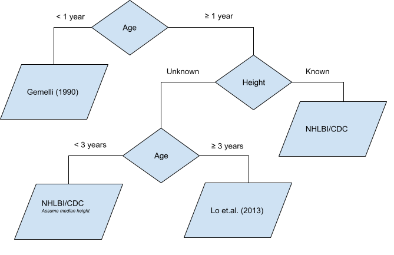

# pedbp : Pediatric Blood Pressure 
An R package for estimating expected blood pressure of children and adolescences

[](https://www.repostatus.org/#active)
[](https://github.com/dewittpe/pedbp/actions/workflows/R-CMD-check.yaml)
[](https://app.codecov.io/gh/dewittpe/pedbp)

[](https://cran.r-project.org/package=pedbp)
[](https://www.r-pkg.org/pkg/pedbp)
[](https://www.r-pkg.org/pkg/pedbp)

[](https://www.gnu.org/licenses/old-licenses/gpl-2.0.html)
[](https://cran.r-project.org/)

## Objectives

1. Provide a method for translating pediatric blood pressures, dependent on age,
   sex, and height (if known), to percentiles.

2. Provide functions to get the percentiles for other growth standards.

## Citing pedbp

If you use this package in your research please cite the package

```r
citation("pedbp", auto = TRUE)
```

And the research letter:


```r
citation("pedbp")
```

```
## To cite pedbp please cite the research letter and the package itself
## via citation('pedbp', auto = TRUE)
## 
##   Martin, Blake, DeWitt, E. P, Albers, David, Bennett, D. T (2022).
##   "Development of a Pediatric Blood Pressure Percentile Tool for
##   Clinical Decision Support." _JAMA Network Open_, *5*(10),
##   e2236918-e2236918. ISSN 2574-3805,
##   doi:10.1001/jamanetworkopen.2022.36918
##   <https://doi.org/10.1001/jamanetworkopen.2022.36918>,
##   https://jamanetwork.com/journals/jamanetworkopen/articlepdf/2797401/martin_2022_ld_220236_1665075001.39453.pdf,
##   <https://doi.org/10.1001/jamanetworkopen.2022.36918>.
## 
## A BibTeX entry for LaTeX users is
## 
##   @Article{,
##     author = {{Martin} and {Blake} and {DeWitt} and Peter E. and {Albers} and {David} and {Bennett} and Tellen D.},
##     title = {Development of a Pediatric Blood Pressure Percentile Tool for Clinical Decision Support},
##     journal = {JAMA Network Open},
##     volume = {5},
##     number = {10},
##     pages = {e2236918-e2236918},
##     year = {2022},
##     month = {10},
##     issn = {2574-3805},
##     doi = {10.1001/jamanetworkopen.2022.36918},
##     url = {https://doi.org/10.1001/jamanetworkopen.2022.36918},
##     eprint = {https://jamanetwork.com/journals/jamanetworkopen/articlepdf/2797401/martin_2022_ld_220236_1665075001.39453.pdf},
##   }
```

## Methodology

Blood pressure percentiles are based on Gaussian distributions defined by published
values for the mean and standard deviation, or derived mean and standard
deviations based on published percentiles.  Growth standards are based on LMS
approximations.  All the methods get parameters based on lookup tables.

## Blood Pressure
There are several data sources used to inform the blood pressure percentiles
estimates:

1. Gemelli et al. (1990)
2. Lo et al. (2013)
3. NHLBI/CDC (2011)
4. Flynn et al. (2017)

The default method is to use the workflow defined in Martin, DeWitt, et al.
(2022).



End users may opt to use any single data source.

Example: A 28 month old female with a stature of 92 cm has a recorded blood
pressure of 95/50.  Find the percentiles.

```r
library(pedbp)
p_bp(q_sbp = 95, q_dbp = 50, male = 0, age = 28, height = 92) # Default
```

```
## $sbp_percentile
## [1] 0.7086064
## 
## $dbp_percentile
## [1] 0.6428859
```

```r
p_bp(q_sbp = 95, q_dbp = 50, male = 0, age = 28, height = 92, source = "martin2022")  # Default
```

```
## $sbp_percentile
## [1] 0.7086064
## 
## $dbp_percentile
## [1] 0.6428859
```

```r
p_bp(q_sbp = 95, q_dbp = 50, male = 0, age = 28, height = 92, source = "gemelli1990")
```

```
## $sbp_percentile
## [1] NA
## 
## $dbp_percentile
## [1] NA
```

```r
p_bp(q_sbp = 95, q_dbp = 50, male = 0, age = 28, height = 92, source = "lo2013")
```

```
## $sbp_percentile
## [1] NA
## 
## $dbp_percentile
## [1] NA
```

```r
p_bp(q_sbp = 95, q_dbp = 50, male = 0, age = 28, height = 92, source = "nhlbi")
```

```
## $sbp_percentile
## [1] 0.7086064
## 
## $dbp_percentile
## [1] 0.6428859
```

```r
p_bp(q_sbp = 95, q_dbp = 50, male = 0, age = 28, height = 92, source = "flynn2017")
```

```
## $sbp_percentile
## [1] 0.6797595
## 
## $dbp_percentile
## [1] 0.5422765
```

You can also find the quantile values.  Example: what is the SBP/DBP values for
the 42nd percentile of 13 year (156 month) old males in the 90th height percentile?

```r
q_bp(p_sbp = 0.42, p_dbp = 0.42, age = 156, male = 1, height_percentile = 0.90)
```

```
## $sbp
## [1] 108.5792
## 
## $dbp
## [1] 62.12428
```

```r
q_bp(p_sbp = 0.42, p_dbp = 0.42, age = 156, male = 1, height_percentile = 0.90, source = "martin2022")
```

```
## $sbp
## [1] 108.5792
## 
## $dbp
## [1] 62.12428
```

```r
q_bp(p_sbp = 0.42, p_dbp = 0.42, age = 156, male = 1, height_percentile = 0.90, source = "gemelli1990")
```

```
## $sbp
## [1] NA
## 
## $dbp
## [1] NA
```

```r
q_bp(p_sbp = 0.42, p_dbp = 0.42, age = 156, male = 1, height_percentile = 0.90, source = "lo2013")
```

```
## $sbp
## [1] 108.5792
## 
## $dbp
## [1] 62.12428
```

```r
q_bp(p_sbp = 0.42, p_dbp = 0.42, age = 156, male = 1, height_percentile = 0.90, source = "nhlbi")
```

```
## $sbp
## [1] 108.7961
## 
## $dbp
## [1] 61.65239
```

```r
q_bp(p_sbp = 0.42, p_dbp = 0.42, age = 156, male = 1, height_percentile = 0.90, source = "flynn2017")
```

```
## $sbp
## [1] 108.6517
## 
## $dbp
## [1] 61.93385
```

More examples can be found in the vignette.

```r
vignette("bp-distributions", package = "pedbp")
```

## Growth Standards

Growth standards based on both CDC and WHO data are provided in this package.
Read more in the vignette

```r
vignette(topic = "growth-standards", package = "pedbp")
```

Growth standards implemented in the package are:
* `bmi_for_age`
* `head_circumference_for_age`
* `height_for_age`
* `length_for_age`
* `weight_for_age`
* `weight_for_length`
* `weight_for_height`


```r
# Example: what is the percentile for a BMI of 23 in a 14.5 year old male?
p_bmi_for_age(q = 23, male = 1, age = 14.5*12, source = "CDC")
```

```
## [1] 0.8502674
```

```r
p_bmi_for_age(q = 23, male = 1, age = 14.5*12, source = "WHO")
```

```
## [1] 0.8880632
```

## How to Install `pedbp`

Install from CRAN:


```r
install.packages("pedbp")
```

Install the developmental version:

```r
remotes::install_github("dewittpe/pedbp", dependencies = TRUE)
```

*NOTE:* If you are working on a Windows machine you will need to download and
install [`Rtools`](https://cran.r-project.org/bin/windows/Rtools/).

## Shiny Application

An interactive [Shiny](https://shiny.posit.co/) application is also available.
After installing the pedbp package and the suggested
packages, you can run the app locally via


```r
shiny::runApp(system.file("shinyapps", "pedbp", package = "pedbp"))
```

The shiny app is also live on [shinyapps.io](https://dewittpe.shinyapps.io/pedbp/)

## References

* Expert Panel On Integrated Guidelines For Cardiovascular Health and Risk Reduction in Children and Adolescents. 2011. “Expert Panel on Integrated Guidelines for Cardiovascular Health and Risk Reduction in Children and Adolescents: Summary Report.” Pediatrics 128 (Supplement_5): S213–56. https://doi.org/10.1542/peds.2009-2107C.

* Gemelli, M, R Manganaro, C Mami, and F De Luca. 1990. “Longitudinal Study of Blood Pressure During the 1st Year of Life.” European Journal of Pediatrics 149 (5): 318–20.

* Lo, Joan C, Alan Sinaiko, Malini Chandra, Matthew F Daley, Louise C Greenspan, Emily D Parker, Elyse O Kharbanda, et.al. 2013. “Prehypertension and Hypertension in Community-Based Pediatric Practice.” Pediatrics 131 (2): e415–24.

* Martin, Blake, Peter E. DeWitt, Scout HF, SK Parker, and Tellen D. Bennett. 2022. “Machine Learning Approach to Predicting Absence of Serious Bacterial Infection at PICU Admission.” Hospital Pediatrics.

* Flynn, Joseph T., David C. Kaelber, Carissa M. Baker-Smith, Douglas Blowey, Aaron E. Carroll, Stephen R. Daniels, Sarah D. De Ferranti et al. "Clinical practice guideline for screening and management of high blood pressure in children and adolescents." Pediatrics 140, no. 3 (2017).
