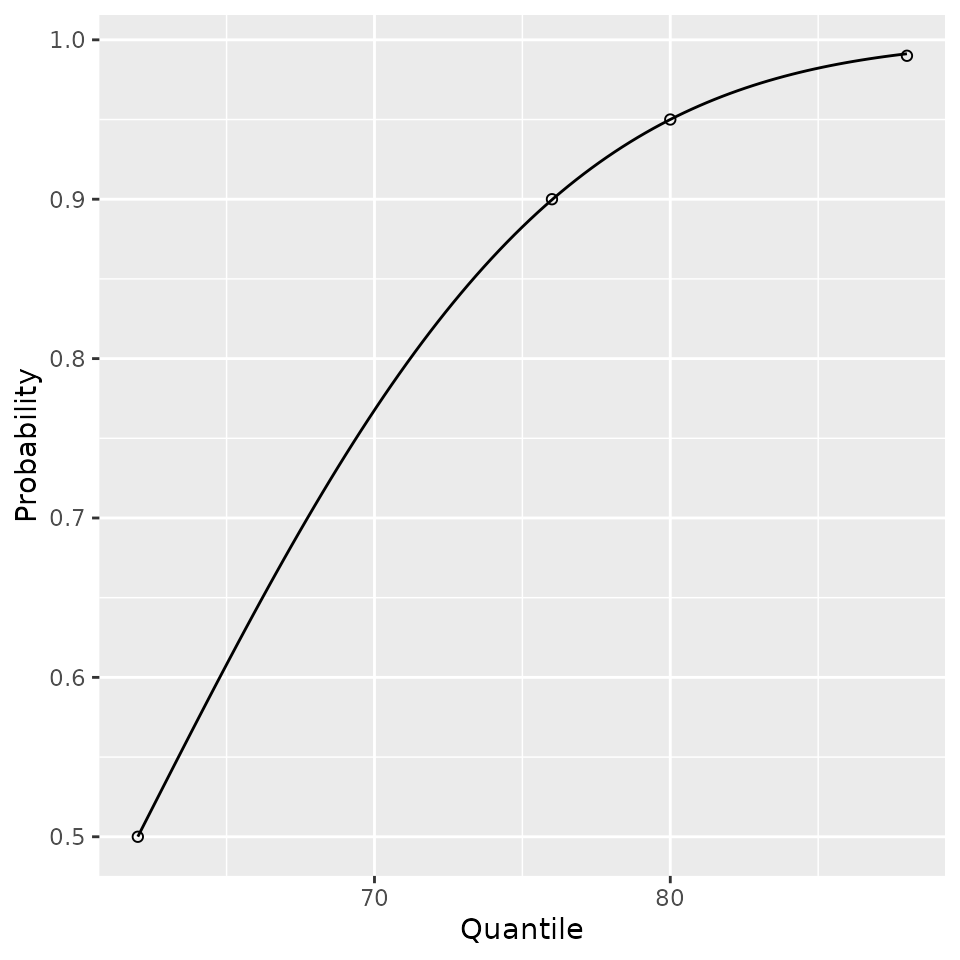
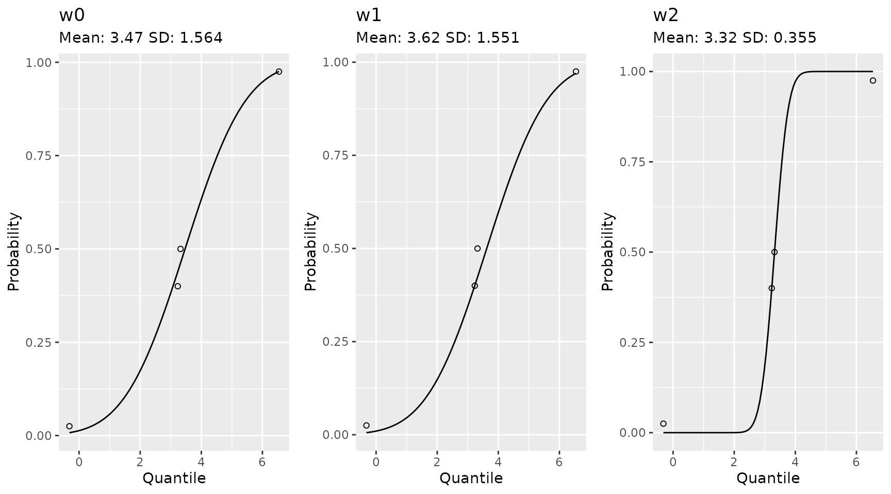

# Additional Utilities

## Additional Utilities

### Estimating Gaussian Mean and Standard Deviation

The NHLBI data for blood pressures provided values in percentiles. To
get a mean and standard deviation that would work well for estimating
other percentiles and quantiles via a Gaussian distribution we optimized
for values of the mean and standard deviation such that for the provided
quantiles $q_{i}$ at the $p_{i}$ percentiles and $X \sim N(\mu,\sigma)$,

$$\sum\limits_{i}\left( \Pr\left( X \leq q_{i} \right) - p_{i} \right)^{2},$$

was minimized. The NHLBI data is provided to the end user.

``` r
data(list = "nhlbi_bp_norms", package = "pedbp")
str(nhlbi_bp_norms)
## 'data.frame':    952 obs. of  6 variables:
##  $ male             : int  0 0 0 0 0 0 0 0 0 0 ...
##  $ age              : num  12 12 12 12 12 12 12 12 12 12 ...
##  $ height_percentile: int  5 5 5 5 10 10 10 10 25 25 ...
##  $ bp_percentile    : int  50 90 95 99 50 90 95 99 50 90 ...
##  $ sbp              : int  83 97 100 108 84 97 101 108 85 98 ...
##  $ dbp              : int  38 52 56 64 39 53 57 64 39 53 ...
```

For an example of how we fitted the parameters:

``` r
d <- nhlbi_bp_norms[nhlbi_bp_norms$age == 144 & nhlbi_bp_norms$height_percentile == 50, ]
d <- d[d$male == 0, ]
d
##     male age height_percentile bp_percentile sbp dbp
## 321    0 144                50            50 105  62
## 322    0 144                50            90 119  76
## 323    0 144                50            95 123  80
## 324    0 144                50            99 130  88

est_norm(q = d$sbp, p = d$bp_percentile / 100)
##      mean        sd 
## 105.00094  10.92093
est_norm(q = d$dbp, p = d$bp_percentile / 100)
##     mean       sd 
## 61.99818 10.94217

bp_parameters[bp_parameters$male == 0 & bp_parameters$age == 144 & bp_parameters$height_percentile == 50, ]
##        source male age sbp_mean   sbp_sd dbp_mean   dbp_sd height_percentile
## 89      nhlbi    0 144 105.0009 10.92093 61.99818 10.94217                50
## NA       <NA>   NA  NA       NA       NA       NA       NA                NA
## 357 flynn2017    0 144 104.9960 10.21414 62.00717  9.97793                50
```

The est_norm method comes with a plotting method too. The provided
quantiles are plotted as open dots and the fitted distribution function
is plotted to show the fit.

``` r
plot( est_norm(q = d$dbp, p = d$bp_percentile / 100) )
```



If you want to emphasize a data point you can do that as well. Here is
an example from a set of quantiles and percentiles which are not
Gaussian.

``` r
qs <- c(-1.92, 0.05, 0.1, 1.89) * 1.8 + 3.14
ps <- c(0.025, 0.40, 0.50, 0.975)

# with equal weights
w0 <- est_norm(qs, ps)
# weight to ignore one of the middle value and make sure to hit the other
w1 <- est_norm(qs, ps, weights = c(1, 2, 0, 1))
# equal weight the middle, more than the tails
w2 <- est_norm(qs, ps, weights = c(1, 2, 2, 1))
```

``` r
gridExtra::grid.arrange(
  plot(w0) + ggplot2::ggtitle(label = "w0", subtitle = paste0("Mean: ", round(w0$par[1], 2), " SD: ", round(w0$par[2], 3)))
  , plot(w1) + ggplot2::ggtitle(label = "w1", subtitle = paste0("Mean: ", round(w1$par[1], 2), " SD: ", round(w1$par[2], 3)))
  , plot(w2) + ggplot2::ggtitle(label = "w2", subtitle = paste0("Mean: ", round(w2$par[1], 2), " SD: ", round(w2$par[2], 3)))
  , nrow = 1
)
```


