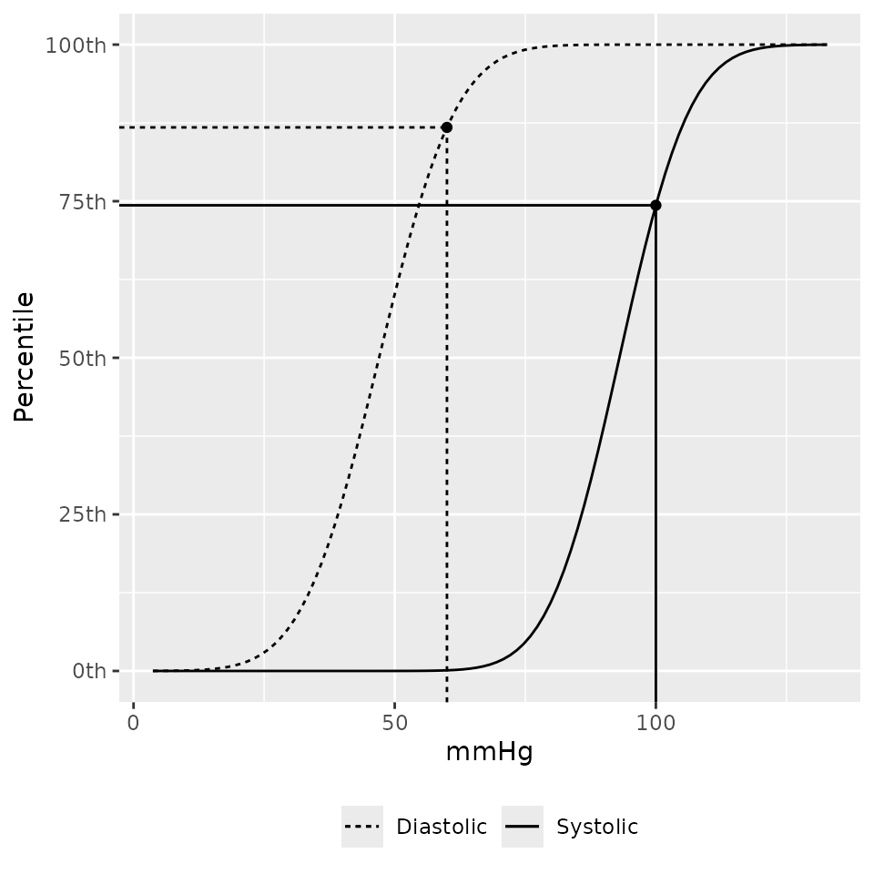
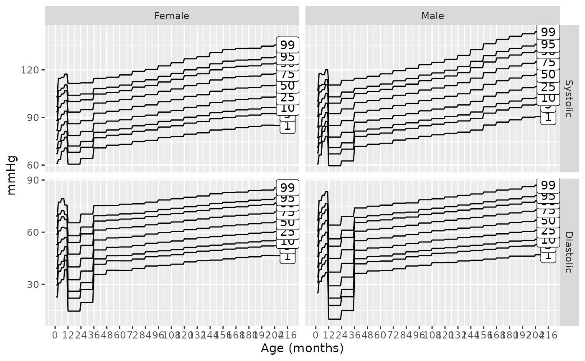
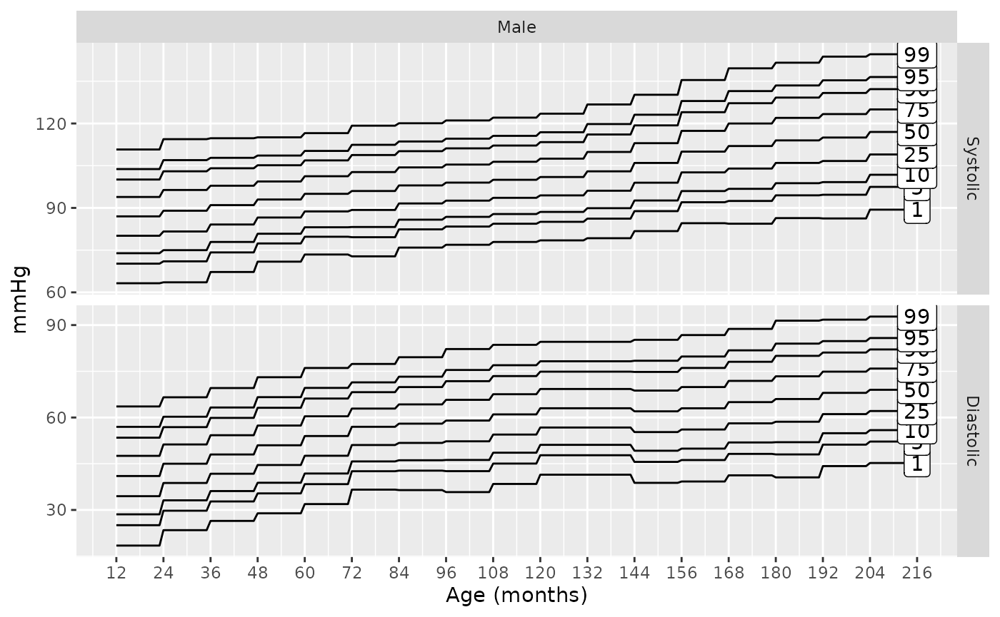

# Overview of Pediatric Blood Pressure Distributions

``` r
library(pedbp)
```

## Introduction

Part of the work of Martin et al. (2022) required transforming blood
pressure measurement into percentiles based on published norms. This
work was complicated by the fact that data for pediatric blood pressure
percentiles is sparse and generally only applicable to children at least
one year of age and requires height, a commonly unavailable data point
in electronic health records for a variety of reasons.

A solution to building pediatric blood pressure percentiles was
developed and is presented here for others to use. Inputs for the
developed method are:

1.  Patient sex (male/female) *required*
2.  Systolic blood pressure (mmHg) *required*
3.  Diastolic blood pressure (mmHg) *required*
4.  Patient height (cm) *if known*.

Given the inputs, the following logic is used to determine which data
sets will be used to inform the blood pressure percentiles. Under one
year of age, the data from Gemelli et al. (1990) will be used; a height
input is not required for this patient subset. For those at least one
year of age with a known height, data from Expert Panel on Integrated
Guidelines for Cardiovascular Health and Risk Reduction in Children and
Adolescents (2011) (hereafter referred to as ‘NHLBI/CDC’ as the report
incorporates recommendations and inputs from the National Heart, Lung,
and Blood Institute \[NHLBI\] and the Centers for Disease Control and
Prevention \[CDC\]). If height is unknown and age is at least three
years, then data from Lo et al. (2013) is used. Lastly, for children
between one and three years of age with unknown height, blood pressure
percentiles are estimated by the NHLBI/CDC data using as a default the
median height for each patient’s sex and age.


With version 2.0.0 and later, the option to select the specific
reference source data was introduced along with the additional Flynn et
al. (2017) reference.

The sources are:

1.  Gemelli et al. (1990) for kids under one year of age.
2.  Lo et al. (2013) for kids over three years of age and when height is
    unknown.
3.  Expert Panel on Integrated Guidelines for Cardiovascular Health and
    Risk Reduction in Children and Adolescents (2011) for kids 1 through
    18 years of age with known stature.
4.  Flynn et al. (2017) for kids 1 through 18 years of age with known
    stature.

The data from Flynn et al. (2017) and Expert Panel on Integrated
Guidelines for Cardiovascular Health and Risk Reduction in Children and
Adolescents (2011) are similar but for one major difference. Flynn et
al. (2017) excluded overweight and obese ( BMI above the 85th
percentile) children and Expert Panel on Integrated Guidelines for
Cardiovascular Health and Risk Reduction in Children and Adolescents
(2011) included overweight and obese children.

## Estimating Pediatric Blood Pressure Distributions

There are two functions provided for working with blood pressure
distributions. These methods use Gaussian distributions for both
systolic and diastolic blood pressures with means and standard
deviations either explicitly provided in an aforementioned source or
derived by optimizing the parameters such that the sum of squared errors
between the provided quantiles from an aforementioned source and the
distribution quantiles is minimized. The provided functions, a
distribution function and a quantile function, follow a similar naming
convention to the distribution functions found in the stats library in
R.

Arguments named `p_sbp` and `p_dbp` are probabilities on the 0 to 1
scale. Arguments named `height_percentile` and displayed percentiles in
text or plots use percentile points on the 0 to 100 scale.

### Percentiles

What percentile for systolic and diastolic blood pressure is 100/60 for
a 44 month old male with unknown height?

``` r
p_bp(q_sbp = 100, q_dbp = 60, age = 44, male = 1)
## $sbp_p
## [1] 0.7700861
## 
## $dbp_p
## [1] 0.72739
```

Using the default source of `martin2022` the data source for the above
is Lo et al. (2013) since height was not specified. The same result
could be found by explicitly using the `lo2013` source.

``` r
p_bp(q_sbp = 100, q_dbp = 60, age = 44, male = 1, source = "lo2013")
## $sbp_p
## [1] 0.7700861
## 
## $dbp_p
## [1] 0.72739
```

Those percentiles would be modified if height was 103 cm:

``` r
p_bp(q_sbp = 100, q_dbp = 60, age = 44, male = 1, height = 103)
## $sbp_p
## [1] 0.7434636
## 
## $dbp_p
## [1] 0.8678361
p_bp(q_sbp = 100, q_dbp = 60, age = 44, male = 1, height = 103, source = "nhlbi")
## $sbp_p
## [1] 0.7434636
## 
## $dbp_p
## [1] 0.8678361
```

If you don’t have the height, but you do have the height percentiles you
can use that instead:

``` r
p_height_for_age(103, male = 1, age = 44)
## [1] 0.795653
x <- p_bp(q_sbp = 100, q_dbp = 60, age = 44, male = 1, height_percentile = 80, source = "nhlbi")
x
## $sbp_p
## [1] 0.7434636
## 
## $dbp_p
## [1] 0.8678361
```

A plotting method to show where the observed blood pressures are on the
distribution function is also provided.

``` r
bp_cdf(sbp = 100, dbp = 60, age = 44, male = 1, height_percentile = 80, source = "nhlbi")
```



Vectors of blood pressures can be used as well. `NA` values will return
`NA`.

``` r
bps <-
  p_bp(
         q_sbp  = c(100, NA, 90)
       , q_dbp  = c(60, 82, 48)
       , age    = 44
       , male   = 1
      )
bps
## $sbp_p
## [1] 0.7700861        NA 0.3639854
## 
## $dbp_p
## [1] 0.7273900 0.9995515 0.1903674
```

If you want to know which data source was used in computing each of the
percentile estimates you can look at the `bp_params` attribute:

``` r
attr(bps, "bp_params")
##   source male age sbp_mean sbp_sd dbp_mean dbp_sd height_percentile
## 1 lo2013    1  36     93.2    9.2     55.1    8.1                NA
## 2 lo2013    1  36     93.2    9.2     55.1    8.1                NA
## 3 lo2013    1  36     93.2    9.2     55.1    8.1                NA
str(bps)
## List of 2
##  $ sbp_p: num [1:3] 0.77 NA 0.364
##  $ dbp_p: num [1:3] 0.727 1 0.19
##  - attr(*, "bp_params")='data.frame':    3 obs. of  8 variables:
##   ..$ source           : chr [1:3] "lo2013" "lo2013" "lo2013"
##   ..$ male             : int [1:3] 1 1 1
##   ..$ age              : num [1:3] 36 36 36
##   ..$ sbp_mean         : num [1:3] 93.2 93.2 93.2
##   ..$ sbp_sd           : num [1:3] 9.2 9.2 9.2
##   ..$ dbp_mean         : num [1:3] 55.1 55.1 55.1
##   ..$ dbp_sd           : num [1:3] 8.1 8.1 8.1
##   ..$ height_percentile: num [1:3] NA NA NA
##  - attr(*, "class")= chr [1:2] "pedbp_bp" "pedbp_p_bp"
```

### Quantiles

If you have a percentile value and want to know the associated systolic
and diastolic blood pressures:

``` r
q_bp(
       p_sbp = c(0.701, NA, 0.36)
     , p_dbp = c(0.85, 0.99, 0.50)
     , age = 44
     , male = 1
    )
## $sbp
## [1] 98.05096       NA 89.90218
## 
## $dbp
## [1] 63.49511 73.94342 55.10000
```

### Working With More Than One Patient

The `p_bp` and `q_bp` methods are designed accept vectors for each of
the arguments. These methods expected each argument to be length 1 or
all the same length.

``` r
eg_data <- read.csv(system.file("example_data", "for_batch.csv", package = "pedbp"))
eg_data
##           pid age_months male height..cm. sbp..mmHg. dbp..mmHg.
## 1   patient_A         96    1          NA        102         58
## 2   patient_B        144    0         153        113         NA
## 3   patient_C          4    0          62         82         43
## 4 patient_D_1         41    1          NA         96         62
## 5 patient_D_2         41    1         101         96         62

bp_percentiles <-
  p_bp(
         q_sbp  = eg_data$sbp..mmHg.
       , q_dbp  = eg_data$dbp..mmHg.
       , age    = eg_data$age
       , male   = eg_data$male
       , height = eg_data$height
       )
bp_percentiles
## $sbp_p
## [1] 0.5533069 0.7680539 0.2622697 0.6195685 0.6101919
## 
## $dbp_p
## [1] 0.4120704        NA 0.1356661 0.8028518 0.9011250

str(bp_percentiles)
## List of 2
##  $ sbp_p: num [1:5] 0.553 0.768 0.262 0.62 0.61
##  $ dbp_p: num [1:5] 0.412 NA 0.136 0.803 0.901
##  - attr(*, "bp_params")='data.frame':    5 obs. of  8 variables:
##   ..$ source           : chr [1:5] "lo2013" "nhlbi" "gemelli1990" "lo2013" ...
##   ..$ male             : int [1:5] 1 0 0 1 1
##   ..$ age              : num [1:5] 96 144 3 36 36
##   ..$ sbp_mean         : num [1:5] 100.7 105 89 93.2 93
##   ..$ sbp_sd           : num [1:5] 9.7 10.9 11 9.2 10.7
##   ..$ dbp_mean         : num [1:5] 59.8 62 54 55.1 47
##   ..$ dbp_sd           : num [1:5] 8.1 10.9 10 8.1 11.6
##   ..$ height_percentile: num [1:5] NA 50 NA NA 75
##  - attr(*, "class")= chr [1:2] "pedbp_bp" "pedbp_p_bp"
```

Going from percentiles back to quantiles:

``` r
q_bp(
       p_sbp  = bp_percentiles$sbp_p
     , p_dbp  = bp_percentiles$dbp_p
     , age    = eg_data$age
     , male   = eg_data$male
     , height = eg_data$height
     )
## $sbp
## [1] 102 113  82  96  96
## 
## $dbp
## [1] 58 NA 43 62 62
```

## Blood Pressure Charts

Percentiles over age:

``` r
bp_chart()
```



The percentiles curves for a males in the 75th height percentile based
on the Flynn et al. (2017) data:

``` r
bp_chart(male = 1, height_percentile = 75, source = "flynn2017")
```



## References

Expert Panel on Integrated Guidelines for Cardiovascular Health and Risk
Reduction in Children and Adolescents. 2011. “Expert Panel on Integrated
Guidelines for Cardiovascular Health and Risk Reduction in Children and
Adolescents: Summary Report.” *Pediatrics* 128 (Supplement_5): S213–56.
<https://doi.org/10.1542/peds.2009-2107C>.

Flynn, Joseph T, David C Kaelber, Carissa M Baker-Smith, Douglas Blowey,
Aaron E Carroll, Stephen R Daniels, Sarah D de Ferranti, et al. 2017.
“Clinical Practice Guideline for Screening and Management of High Blood
Pressure in Children and Adolescents.” *Pediatrics* 140 (3).

Gemelli, M, R Manganaro, C Mamí, and F De Luca. 1990. “Longitudinal
Study of Blood Pressure During the 1st Year of Life.” *European Journal
of Pediatrics* 149 (5): 318–20. <https://doi.org/10.1007/BF02171556>.

Lo, Joan C, Alan Sinaiko, Malini Chandra, Matthew F Daley, Louise C
Greenspan, Emily D Parker, Elyse O Kharbanda, et al. 2013.
“Prehypertension and Hypertension in Community-Based Pediatric
Practice.” *Pediatrics* 131 (2): e415–24.
<https://doi.org/10.1542/peds.2012-1292>.

Martin, Blake, Peter E DeWitt, Halden F Scott, Sarah Parker, and Tellen
D Bennett. 2022. “Machine Learning Approach to Predicting Absence of
Serious Bacterial Infection at PICU Admission.” *Hospital Pediatrics* 12
(6): 590–603.
https://doi.org/<https://doi.org/10.1542/hpeds.2021-005998>.
