# Pediatric Blood Pressure Distributions

``` r
library(pedbp)
```

## Introduction

Part of the work of Martin, DeWitt, Scott, et al. (2022) required
transforming blood pressure measurement into percentiles based on
published norms. This work was complicated by the fact that data for
pediatric blood pressure percentiles is sparse and generally only
applicable to children at least one year of age and requires height, a
commonly unavailable data point in electronic health records for a
variety of reasons.

A solution to building pediatric blood pressure percentiles was
developed and is presented here for others to use. Inputs for the
developed method are:

1.  Patient sex (male/female) *required*
2.  Systolic blood pressure (mmHg) *required*
3.  Diastolic blood pressure (mmHg) *required*
4.  Patient height (cm) *if known*.

Given the inputs, the following logic is used to determine which data
sets will be used to inform the blood pressure percentiles. Under one
year of age, the data from Gemelli et al. (1990) will be used; a height
input is not required for this patient subset. For those at least one
year of age with a known height, data from Expert Panel on Integrated
Guidelines for Cardiovascular Health and Risk Reduction in Children and
Adolescents (2011) (hereafter referred to as ‘NHLBI/CDC’ as the report
incorporates recommendations and inputs from the National Heart, Lung,
and Blood Institute \[NHLBI\] and the Centers for Disease Control and
Prevention \[CDC\]). If height is unknown and age is at least three
years, then data from Lo et al. (2013) is used. Lastly, for children
between one and three years of age with unknown height, blood pressure
percentiles are estimated by the NHLBI/CDC data using as a default the
median height for each patient’s sex and age.

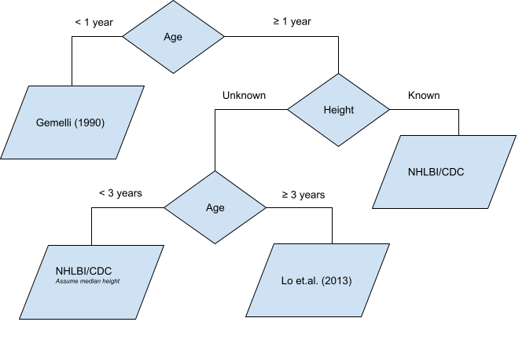

## Estimating Pediatric Blood Pressure Distributions

There are two functions provided for working with blood pressure
distributions. These methods use Gaussian distributions for both
systolic and diastolic blood pressures with means and standard
deviations either explicitly provided in an aforementioned source or
derived by optimizing the parameters such that the sum of squared errors
between the provided quantiles from an aforementioned source and the
distribution quantiles is minimized. The provided functions, a
distribution function and a quantile function, follow a similar naming
convention to the distribution functions found in the stats library in
R.

``` r
args(p_bp)
## function (q_sbp, q_dbp, age, male, height = NA, height_percentile = NA, 
##     default_height_percentile = 50, source = getOption("pedbp_bp_source", 
##         "martin2022"), ...) 
## NULL

# Quantile Function
args(q_bp)
## function (p_sbp, p_dbp, age, male, height = NA, height_percentile = NA, 
##     default_height_percentile = 50, source = getOption("pedbp_bp_source", 
##         "martin2022"), ...) 
## NULL
```

Both methods expect an age in months and an indicator for sex. `height`,
in centimeters, is used preferentially over `height_percentile`. The
`default_height_percentile`. is set to 50 by default to match the
flowchart above, but can be adjusted here to meet the end users needs.

The reference look up tables for the Expert Panel on Integrated
Guidelines for Cardiovascular Health and Risk Reduction in Children and
Adolescents (2011) and Flynn et al. (2017) require height percentiles.
If `height` is entered, then the height percentile is determined via an
LMS method for age and sex using corresponding LMS data from either the
Centers for Disease control (CDC) or the World Health Organization (WHO)
based on age. Under 36 months use the WHO data to estimate the height
percentile and for 36 months and over use the CDC data. The look up
table will use the percentile nearest the calculated value. Look up
height percentiles values are: 5, 10, 25, 50, 75, 90, and 95.

If you want to restrict to CDC or WHO values regardless of age, we
recommend using `p_height_for_age` and `p_length_for_age` to get height
(stature) percentiles and pass the result to the `height_percentile`
argument.

### Percentiles

What percentile for systolic and diastolic blood pressure is 100/60 for
a 44 month old male with unknown height?

``` r
p_bp(q_sbp = 100, q_dbp = 60, age = 44, male = 1)
## $sbp_p
## [1] 0.7700861
## 
## $dbp_p
## [1] 0.72739
```

Those percentiles would be modified if height was 103 cm:

``` r
p_bp(q_sbp = 100, q_dbp = 60, age = 44, male = 1, height = 103)
## $sbp_p
## [1] 0.7434636
## 
## $dbp_p
## [1] 0.8678361
```

For the age and sex, the height of 103 is approximately the 79th
percentile.

``` r
p_height_for_age(103, male = 1, age = 44)
## [1] 0.795653
x <- p_bp(q_sbp = 100, q_dbp = 60, age = 44, male = 1, height_percentile = 0.80, source = "nhlbi")
x
## $sbp_p
## [1] 0.9000536
## 
## $dbp_p
## [1] 0.9152593
```

A plotting method to show where the observed blood pressures are on the
distribution function is also provided.

``` r
bp_cdf(sbp = 90, dbp = 55, age = 44, male = 1, height = 103, source = "nhlbi")
```

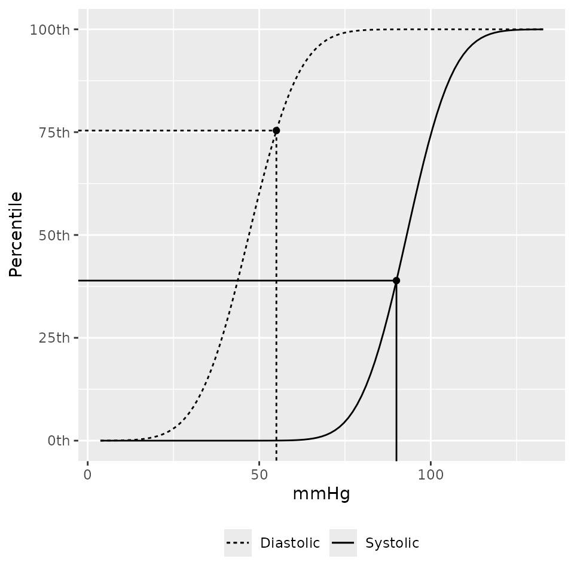

Vectors of blood pressures can be used as well. NA values will return
NA.

``` r
bps <-
  p_bp(
         q_sbp  = c(100, NA, 90)
       , q_dbp  = c(60, 82, 48)
       , age    = 44
       , male   = 1
       , height_percentile = 0.80
      )
bps
## $sbp_p
## [1] 0.9000536        NA 0.6428859
## 
## $dbp_p
## [1] 0.9152593 0.9994494 0.6343003
```

If you want to know which data source was used in computing each of the
percentile estimates you can look at the `bp_params` attribute:

``` r
attr(bps, "bp_params")
##   source male age sbp_mean   sbp_sd dbp_mean   dbp_sd height_percentile
## 1  nhlbi    1  36 86.00094 10.92093 44.00316 11.64362                 5
## 2  nhlbi    1  36 86.00094 10.92093 44.00316 11.64362                 5
## 3  nhlbi    1  36 86.00094 10.92093 44.00316 11.64362                 5
```

### Quantiles

If you have a percentile value and want to know the associated systolic
and diastolic blood pressures:

``` r
q_bp(
       p_sbp = c(0.701, NA, 0.36)
     , p_dbp = c(0.85, 0.99, 0.50)
     , age = 44
     , male = 1
     , height_percentile = 0.80
    )
## $sbp
## [1] 91.75931       NA 82.08624
## 
## $dbp
## [1] 56.07099 71.09026 44.00316
```

### Working With More Than One Patient

The `p_bp` and `q_bp` methods are designed accept vectors for each of
the arguments. These methods expected each argument to be length 1 or
all the same length.

``` r
eg_data <- read.csv(system.file("example_data", "for_batch.csv", package = "pedbp"))
eg_data
##           pid age_months male height..cm. sbp..mmHg. dbp..mmHg.
## 1   patient_A         96    1          NA        102         58
## 2   patient_B        144    0         153        113         NA
## 3   patient_C          4    0          62         82         43
## 4 patient_D_1         41    1          NA         96         62
## 5 patient_D_2         41    1         101         96         62

bp_percentiles <-
  p_bp(
         q_sbp  = eg_data$sbp..mmHg.
       , q_dbp  = eg_data$dbp..mmHg.
       , age    = eg_data$age
       , male   = eg_data$male
       , height = eg_data$height
       )
bp_percentiles
## $sbp_p
## [1] 0.5533069 0.7680539 0.2622697 0.6195685 0.6101919
## 
## $dbp_p
## [1] 0.4120704        NA 0.1356661 0.8028518 0.9011250

str(bp_percentiles)
## List of 2
##  $ sbp_p: num [1:5] 0.553 0.768 0.262 0.62 0.61
##  $ dbp_p: num [1:5] 0.412 NA 0.136 0.803 0.901
##  - attr(*, "bp_params")='data.frame':    5 obs. of  8 variables:
##   ..$ source           : chr [1:5] "lo2013" "nhlbi" "gemelli1990" "lo2013" ...
##   ..$ male             : int [1:5] 1 0 0 1 1
##   ..$ age              : num [1:5] 96 144 3 36 36
##   ..$ sbp_mean         : num [1:5] 100.7 105 89 93.2 93
##   ..$ sbp_sd           : num [1:5] 9.7 10.9 11 9.2 10.7
##   ..$ dbp_mean         : num [1:5] 59.8 62 54 55.1 47
##   ..$ dbp_sd           : num [1:5] 8.1 10.9 10 8.1 11.6
##   ..$ height_percentile: num [1:5] NA 50 NA NA 75
##  - attr(*, "class")= chr [1:2] "pedbp_bp" "pedbp_p_bp"
```

Going from percentiles back to quantiles:

``` r
q_bp(
       p_sbp  = bp_percentiles$sbp_p
     , p_dbp  = bp_percentiles$dbp_p
     , age    = eg_data$age
     , male   = eg_data$male
     , height = eg_data$height
     )
## $sbp
## [1] 102 113  82  96  96
## 
## $dbp
## [1] 58 NA 43 62 62
```

## Select Source Data

The default method for estimating blood pressure percentiles is based on
the method of Martin, DeWitt, Scott, et al. (2022) and Martin, DeWitt,
Albers, et al. (2022) which uses three different references depending on
age and known/unknown stature. If you want to use a specific reference
then you can do so by using the `source` argument.

If you have a project with the want/need to use a specific source and
you’d to use you can set it as an option:

``` r
options(pedbp_bp_source = "martin2022")  # default
```

There are four sources:

1.  Gemelli et al. (1990) for kids under one year of age.
2.  Lo et al. (2013) for kids over three years of age and when height is
    unknown.
3.  Expert Panel on Integrated Guidelines for Cardiovascular Health and
    Risk Reduction in Children and Adolescents (2011) for kids 1 through
    18 years of age with known stature.
4.  Flynn et al. (2017) for kids 1 through 18 years of age with known
    stature.

The data from Flynn et al. (2017) and Expert Panel on Integrated
Guidelines for Cardiovascular Health and Risk Reduction in Children and
Adolescents (2011) are similar but for one major difference. Flynn et
al. (2017) excluded overweight and obese ( BMI above the 85th
percentile) children.

For example, the estimated percentile for a blood pressure of 92/60 in a
39.2 month old female in the 95th height percentile are:

``` r
d <- data.frame(source = c("martin2022", "gemelli1990", "lo2013", "nhlbi", "flynn2017"),
                p_sbp = NA_real_,
                p_dbp = NA_real_)

for(i in 1:nrow(d)) {
  bp <- p_bp(q_sbp = 92, q_dbp = 60, age = 39.2, male = 0, height_percentile = 95, source = d$source[i])
  d[i, "p_sbp"] <- bp$sbp
  d[i, "p_dbp"] <- bp$dbp
}
d
##        source     p_sbp     p_dbp
## 1  martin2022 0.4612040 0.7950359
## 2 gemelli1990        NA        NA
## 3      lo2013 0.4703190 0.7017401
## 4       nhlbi 0.4612040 0.7950359
## 5   flynn2017 0.4623641 0.7698042
```

The estimated 85th quantile SBP/DBP for a 39.2 month old female, who is
in the 95th height percentile are:

``` r
d <- data.frame(source = c("martin2022", "gemelli1990", "lo2013", "nhlbi", "flynn2017"),
                q_sbp = NA_real_,
                q_dbp = NA_real_)

for(i in 1:nrow(d)) {
  bp <- q_bp(p_sbp = 0.85, p_dbp = 0.85, age = 39.2, male = 0, height_percentile = 95, source = d$source[i])
  d[i, "q_sbp"] <- bp$sbp
  d[i, "q_dbp"] <- bp$dbp
}
d
##        source    q_sbp    q_dbp
## 1  martin2022 103.5868 62.31975
## 2 gemelli1990       NA       NA
## 3      lo2013 102.4425 64.30968
## 4       nhlbi 103.5868 62.31975
## 5   flynn2017 104.0844 62.83117
```

## Comparing to Published Percentiles

The percentiles published in Expert Panel on Integrated Guidelines for
Cardiovascular Health and Risk Reduction in Children and Adolescents
(2011) and Flynn et al. (2017) where used to estimate a Gaussian mean
and standard deviation. This was in part to be consistent with the
values from Gemelli et al. (1990) and Lo et al. (2013). As a result, the
calculated percentiles and quantiles from the pedbp package for Expert
Panel on Integrated Guidelines for Cardiovascular Health and Risk
Reduction in Children and Adolescents (2011) and Flynn et al. (2017)
will be slightly different from the published values.

### Flynn et al.

``` r
fq <-
  q_bp(
     p_sbp = flynn2017$bp_percentile/100,
     p_dbp = flynn2017$bp_percentile/100,
     male  = flynn2017$male,
     age   = flynn2017$age,
     height_percentile = flynn2017$height_percentile,
     source = "flynn2017")

fp <-
  p_bp(
     q_sbp = flynn2017$sbp,
     q_dbp = flynn2017$dbp,
     male  = flynn2017$male,
     age   = flynn2017$age,
     height_percentile = flynn2017$height_percentile,
     source = "flynn2017")

f_bp <-
  cbind(flynn2017,
        pedbp_sbp = fq$sbp,
        pedbp_dbp = fq$dbp,
        pedbp_sbp_p = fp$sbp_p * 100,
        pedbp_dbp_p = fp$dbp_p * 100
  )
```

All the quantile estimates are within 2 mmHg:

``` r
summary(f_bp$pedbp_sbp - f_bp$sbp)
##      Min.   1st Qu.    Median      Mean   3rd Qu.      Max. 
## -1.895796 -0.203214 -0.003978 -0.031863  0.085968  0.749248
summary(f_bp$pedbp_dbp - f_bp$dbp)
##      Min.   1st Qu.    Median      Mean   3rd Qu.      Max. 
## -1.579830 -0.203214  0.004458  0.006043  0.158121  1.126966
```

All the percentiles estimates are within are within 2 percentile points:

``` r
summary(f_bp$pedbp_sbp_p - f_bp$bp_percentile)
##     Min.  1st Qu.   Median     Mean  3rd Qu.     Max. 
## -0.99754 -0.14851  0.01554  0.02097  0.20186  1.69706
summary(f_bp$pedbp_dbp_p - f_bp$bp_percentile)
##       Min.    1st Qu.     Median       Mean    3rd Qu.       Max. 
## -1.2203874 -0.2836688 -0.0191912  0.0001719  0.2212839  1.6970586
```

A helpful set of graphics are shown below. Panels A and C show the
estimated blood pressure quantiles provide by the *pedbp* package
(y-axis) against the published quantiles from Flynn et al. (2017) for
systolic and diastolic blood pressures respectively. Panels B and D are
Bland-Altman plots showing the difference vs average between the two
estimates.

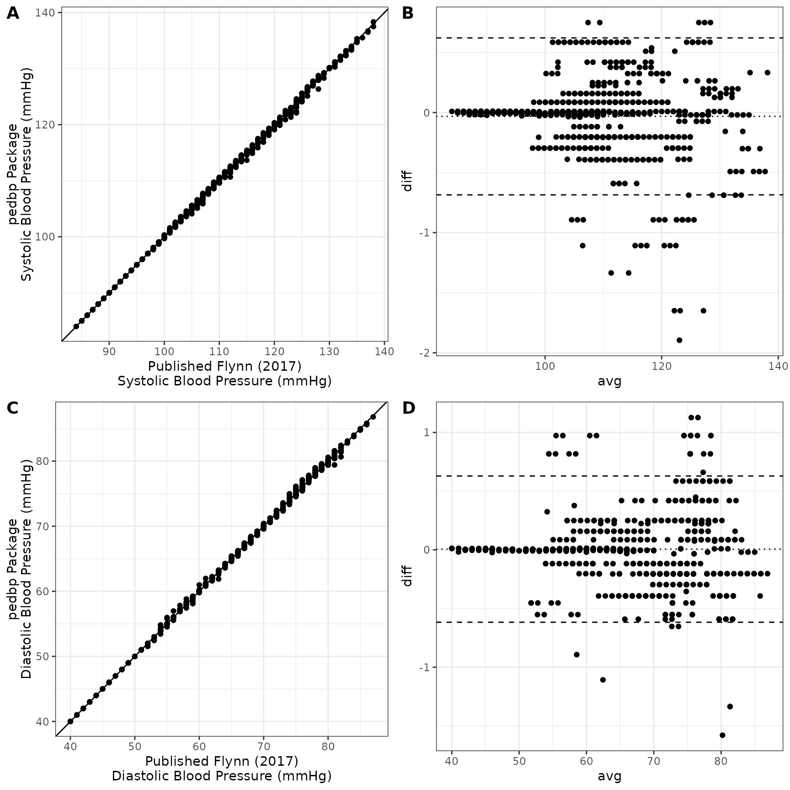

### NHLBI/CDC

``` r
nq <-
  q_bp(
     p_sbp = nhlbi_bp_norms$bp_percentile/100,
     p_dbp = nhlbi_bp_norms$bp_percentile/100,
     male  = nhlbi_bp_norms$male,
     age   = nhlbi_bp_norms$age,
     height_percentile = nhlbi_bp_norms$height_percentile,
     source = "nhlbi")

np <-
  p_bp(
     q_sbp = nhlbi_bp_norms$sbp,
     q_dbp = nhlbi_bp_norms$dbp,
     male  = nhlbi_bp_norms$male,
     age   = nhlbi_bp_norms$age,
     height_percentile = nhlbi_bp_norms$height_percentile,
     source = "nhlbi")

nhlbi_bp <-
  cbind(nhlbi_bp_norms,
        pedbp_sbp = nq$sbp,
        pedbp_dbp = nq$dbp,
        pedbp_sbp_p = np$sbp_p * 100,
        pedbp_dbp_p = np$dbp_p * 100
  )
```

All the quantile estimates are within 2 mmHg:

``` r
summary(nhlbi_bp$pedbp_sbp - nhlbi_bp$sbp)
##      Min.   1st Qu.    Median      Mean   3rd Qu.      Max. 
## -1.199728 -0.173883 -0.003333 -0.014070  0.091753  0.817752
summary(nhlbi_bp$pedbp_dbp - nhlbi_bp$dbp)
##       Min.    1st Qu.     Median       Mean    3rd Qu.       Max. 
## -1.0537249 -0.0357386  0.0009374 -0.0011066  0.0902619  1.0295371
```

All the percentiles are within 2 percentile points:

``` r
summary(nhlbi_bp$pedbp_sbp_p - nhlbi_bp$bp_percentile)
##      Min.   1st Qu.    Median      Mean   3rd Qu.      Max. 
## -0.595528 -0.103685  0.005356  0.004987  0.058757  0.520902
summary(nhlbi_bp$pedbp_dbp_p - nhlbi_bp$bp_percentile)
##      Min.   1st Qu.    Median      Mean   3rd Qu.      Max. 
## -0.457032 -0.033946 -0.003424  0.001301  0.033660  0.602561
```

A helpful set of graphics are shown below. Panels A and C show the
estimated blood pressure quantiles provide by the *pedbp* package
(y-axis) against the published quantiles from Expert Panel on Integrated
Guidelines for Cardiovascular Health and Risk Reduction in Children and
Adolescents (2011) for systolic and diastolic blood pressures
respectively. Panels B and D are Bland-Altman plots showing the
difference vs average between the two estimates.

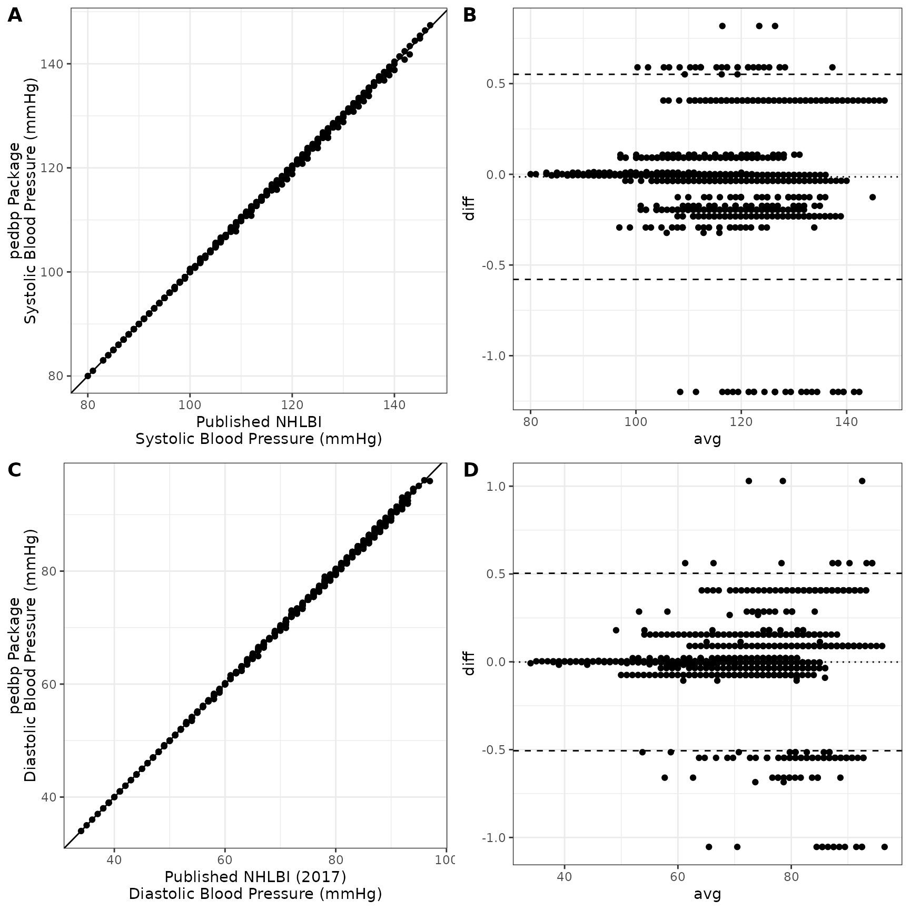

### NHLBI vs Flynn 2017

The NHLBI data included overweight and obese children whereas Flynn
excluded them. As a result, the estimates for blood pressures can differ
significantly between the two sources.

The graphic below shows the estimated systolic and diastolic blood
pressures provided by the *pedbp* package. As expected, the values
estimated based on Flynn are lower, on average, than those estimated by
data from the NHLBI.

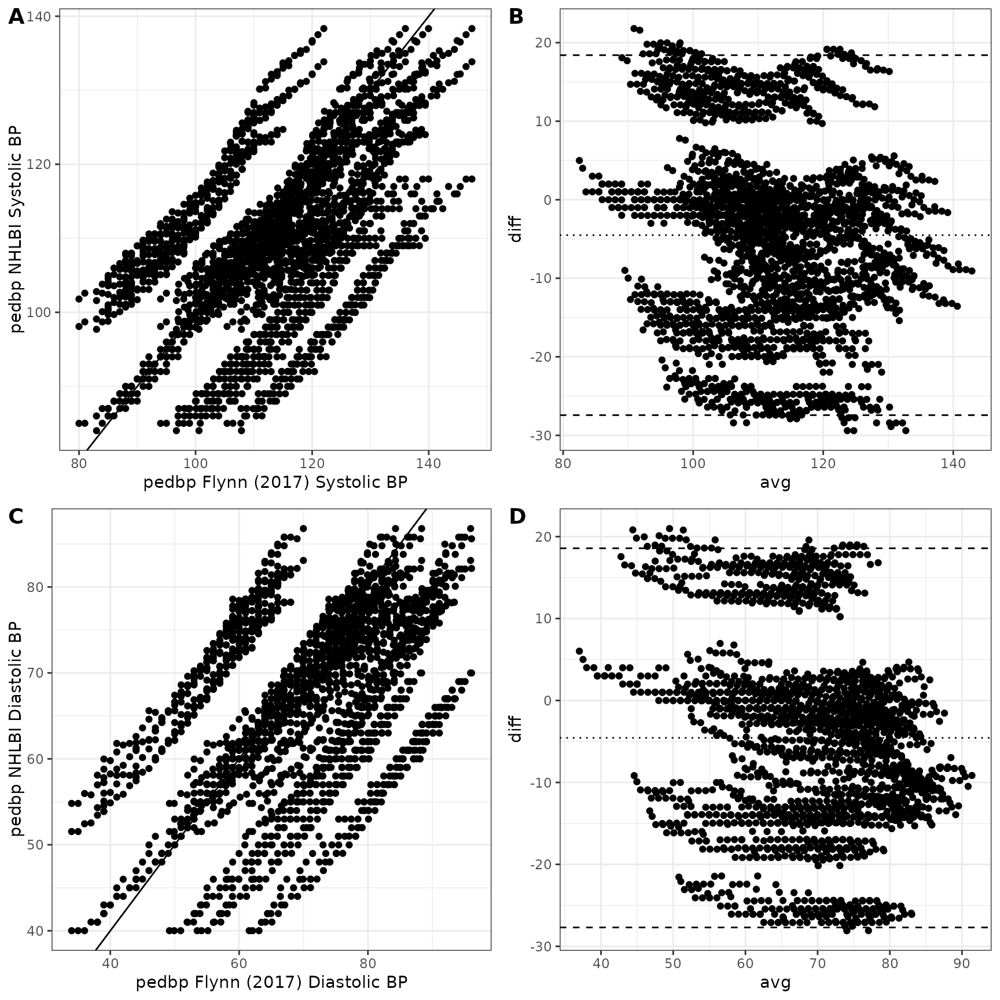

## Blood Pressure Charts

To you can get blood pressure charts for any combination of inputs using
`bp_chart`. For example, the blood pressure percentiles when using
`source = 'martin2022'` and height is unknown are:

``` r
bp_chart(p = c(0.05, 0.1, 0.25, 0.5, 0.75, 0.90, 0.95), source = "martin2022") # default
```

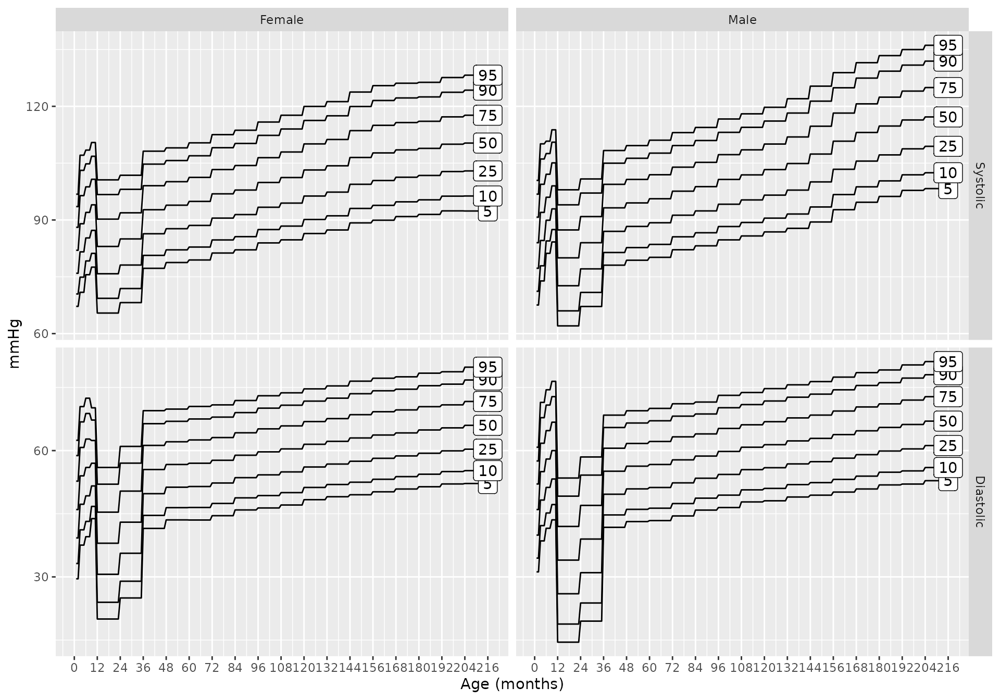

And if height is known (say it is the 25th percentile)

``` r
bp_chart(p = c(0.05, 0.1, 0.25, 0.5, 0.75, 0.90, 0.95),
         height_percentile = 25,
         source = "martin2022")
```

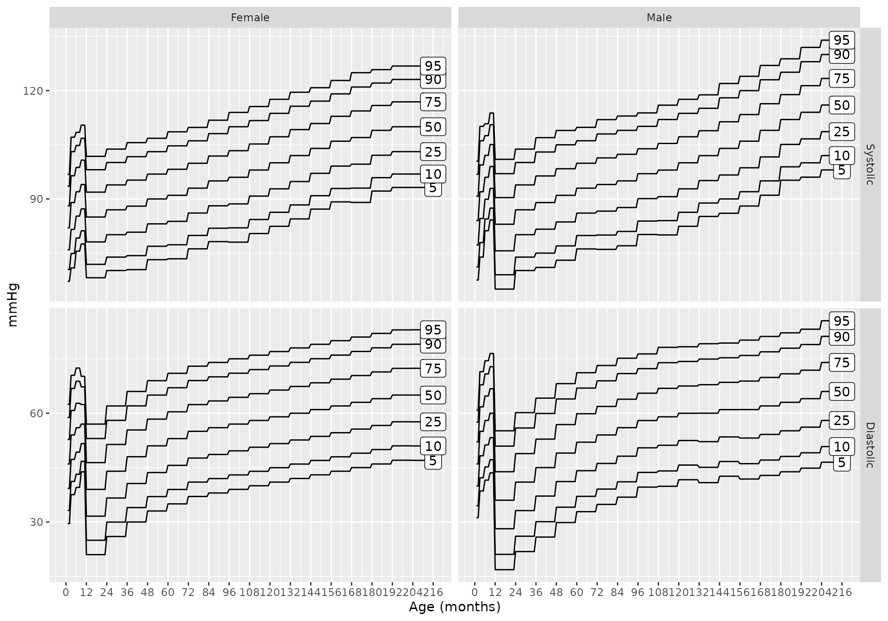

Additionally, charts for each of the specific data sources can be
generated

``` r
bp_chart(source = "gemelli1990")
```

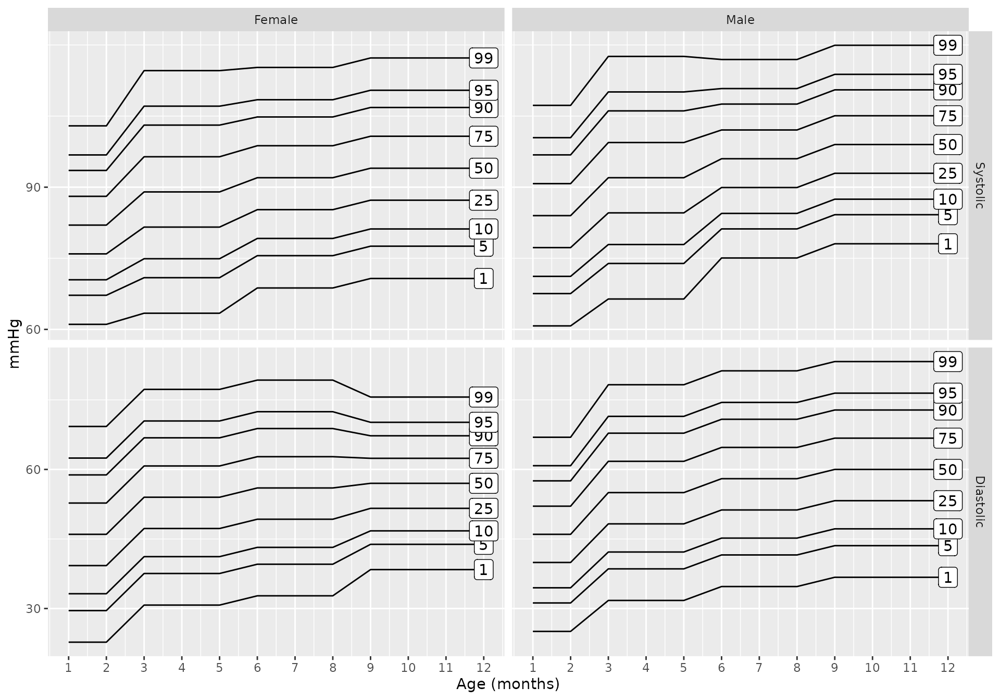

``` r
bp_chart(source = "lo2013")
```

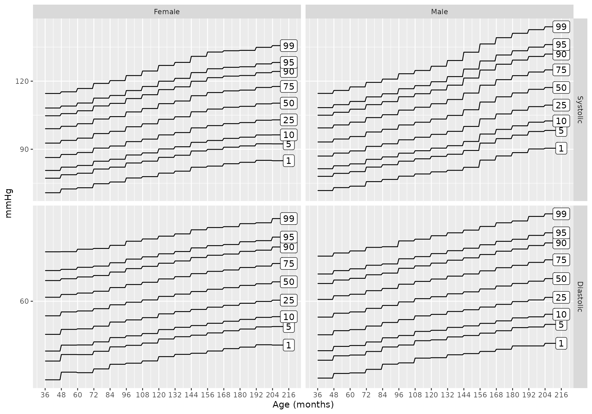

``` r
bp_chart(source = "nhlbi")
```

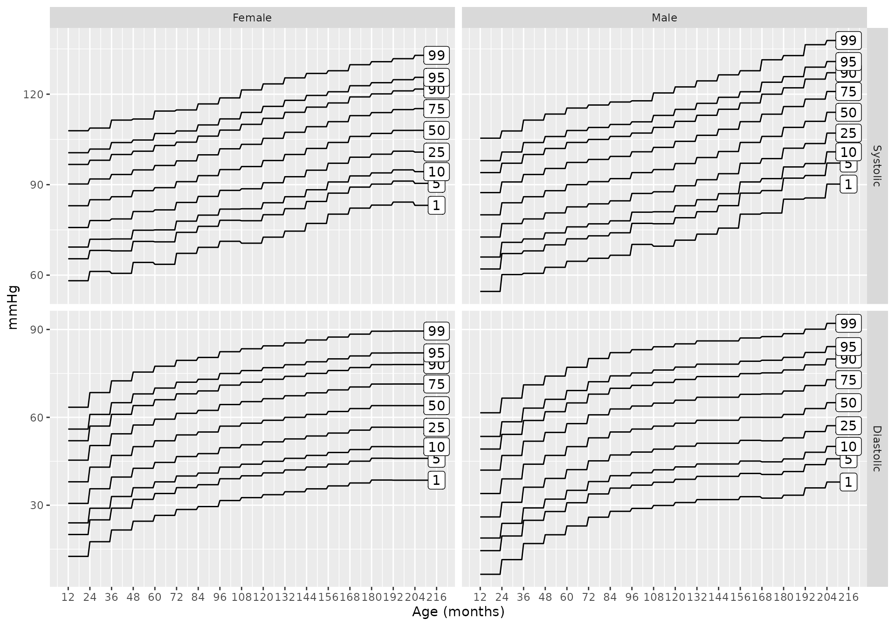

``` r
bp_chart(source = "flynn2017")
```

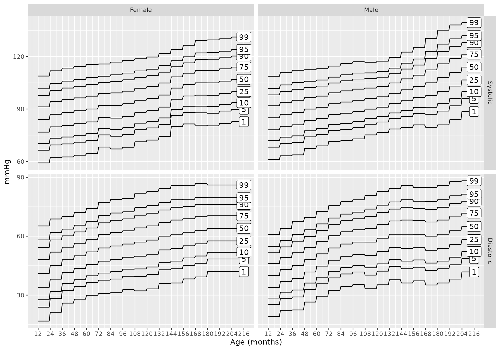

## Shiny Application

An interactive [Shiny](https://shiny.posit.co/) application is also
available. After installing the pedbp package and the suggested
packages, you can run the app locally via

``` r
shiny::runApp(system.file("shinyapps", "pedbp", package = "pedbp"))
```

The shiny application allows for interactive exploration of blood
pressure percentiles for an individual patient and allows for batch
processing a set of patients as well.

## References

Expert Panel on Integrated Guidelines for Cardiovascular Health and Risk
Reduction in Children and Adolescents. 2011. “Expert Panel on Integrated
Guidelines for Cardiovascular Health and Risk Reduction in Children and
Adolescents: Summary Report.” *Pediatrics* 128 (Supplement_5): S213–56.
<https://doi.org/10.1542/peds.2009-2107C>.

Flynn, Joseph T, David C Kaelber, Carissa M Baker-Smith, Douglas Blowey,
Aaron E Carroll, Stephen R Daniels, Sarah D de Ferranti, et al. 2017.
“Clinical Practice Guideline for Screening and Management of High Blood
Pressure in Children and Adolescents.” *Pediatrics* 140 (3).

Gemelli, M, R Manganaro, C Mamí, and F De Luca. 1990. “Longitudinal
Study of Blood Pressure During the 1st Year of Life.” *European Journal
of Pediatrics* 149 (5): 318–20. <https://doi.org/10.1007/BF02171556>.

Lo, Joan C, Alan Sinaiko, Malini Chandra, Matthew F Daley, Louise C
Greenspan, Emily D Parker, Elyse O Kharbanda, et al. 2013.
“Prehypertension and Hypertension in Community-Based Pediatric
Practice.” *Pediatrics* 131 (2): e415–24.
<https://doi.org/10.1542/peds.2012-1292>.

Martin, Blake, Peter E DeWitt, David Albers, and Tellen D Bennett. 2022.
“Development of a Pediatric Blood Pressure Percentile Tool for Clinical
Decision Support.” *JAMA Network Open* 5 (10): e2236918–18.

Martin, Blake, Peter E DeWitt, Halden F Scott, Sarah Parker, and Tellen
D Bennett. 2022. “Machine Learning Approach to Predicting Absence of
Serious Bacterial Infection at PICU Admission.” *Hospital Pediatrics* 12
(6): 590–603.
https://doi.org/<https://doi.org/10.1542/hpeds.2021-005998>.
