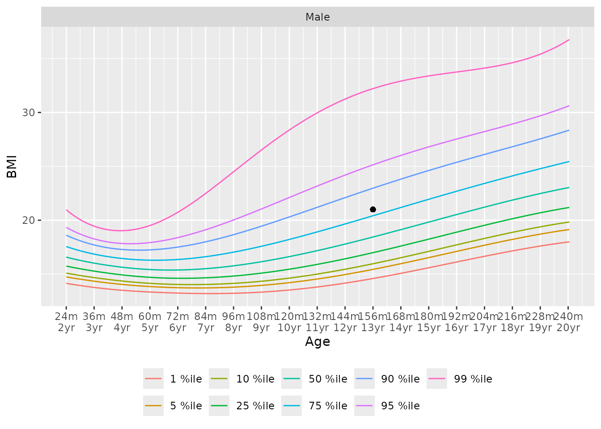
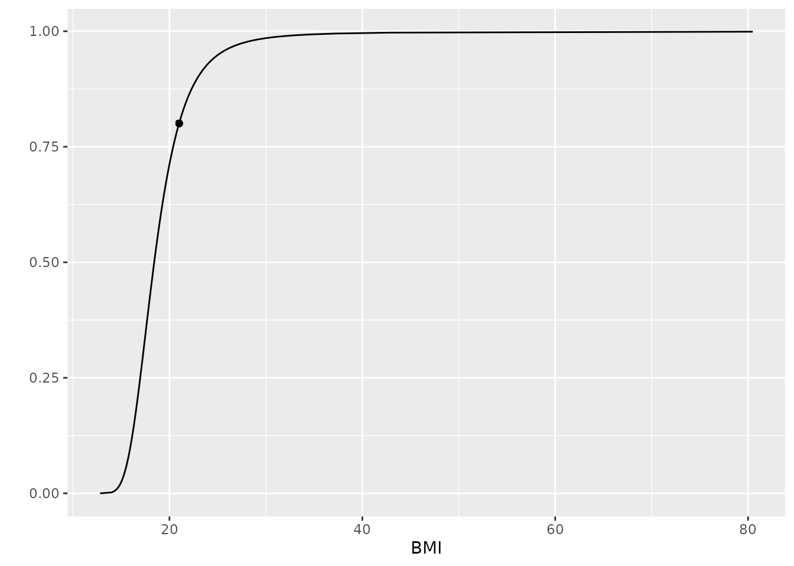

# Overview of Growth Standards

``` r
library(pedbp)
```

## Introduction

Using the [Percentile Data Files with LMS
values](https://www.cdc.gov/growthcharts/percentile_data_files.htm)
provided by the CDC, and [Child Growth
Standards](https://www.who.int/tools/child-growth-standards/standards)
provided by the World Health Organization (WHO), we provide tools for
finding quantiles, percentiles, or z-scores, for the following metrics:

1.  BMI for age
2.  head circumference for age
3.  stature for age
    1.  height for age
    2.  length for age
4.  weight for age
5.  weight for stature
    1.  weight for height
    2.  weight for length

All lengths/heights are in centimeters, ages in months, and weights in
kilograms. Stature is used to refer both height and length; specific
methods are provided for each.

## Method - LMS

All methods use the published LMS parameters to define z-scores,
percentiles, and quantiles for skewed distributions. L is a $\lambda$
parameter, the Box-Cox transformation power; $M$ the median value, and
$S$ a generalized coefficient of variation. For a given percentile or
z-score, the corresponding physical measurement, $X,$ is defined as

$$X = \begin{cases}
{M(1 + \lambda SZ)^{\frac{1}{\lambda}}} & {\lambda \neq 0} \\
{M\exp(SZ)} & {\lambda = 0.}
\end{cases}$$

From this we can get the z-score for a given measurement $X:$

$$Z = \begin{cases}
\frac{\left( \frac{X}{M} \right)^{\lambda} - 1}{\lambda S} & {\lambda \neq 0} \\
\frac{\log\left( \frac{X}{M} \right)}{S} & {\lambda = 0.}
\end{cases}$$

Percentiles are determined using the standard normal distribution of
z-scores.

For all eight of the noted methods we provide a distribution function,
quantile function, and function that returns z-scores.

Arguments named `p` are probabilities on the 0 to 1 scale. When
percentiles are described in text, tables, or figures, they are
expressed as percentile points on the 0 to 100 scale.

## Growth Standards

Each of the growth standard metrics have quantile, distribution, and
z-score function with the naming convention of (`q_<metric>`),
(`p_<metric>`), and (`z_<metric>`), respectively.

Additionally, the function `gs_chart` for building growth standard
charts with percentile curves, and `gs_cdf` for plotting the cumulative
distribution function for a given set of inputs.

**Example**

Find the distribution value for a 13 year (156 month) old male with a
BMI of 21.

    ## [1] 0.8006439
    ## [1] 0.8006439 0.8541621

An easy way to visualize the BMI distribution is to use the growth
standard chart

``` r
gs_chart(metric = "bmi_for_age", male = 1, source = "CDC") +
  ggplot2::geom_point(x = 13 * 12, y = 21, inherit.aes = FALSE)
```



and a cumulative distribution function

``` r
gs_cdf(metric = "bmi_for_age", male = 1, age = 13*12) +
   ggplot2::geom_point(x = 21, y = p_bmi_for_age(21, male = 1, age = 13*12))
```



You can also easily get the z-score instead of the distribution value.

``` r
z_bmi_for_age(q = 21, male = 1, age = 13*12)
## [1] 0.8439234
```

Find the median BMI quantile for a 48 month old female is:

``` r
q_bmi_for_age(p = 0.5, male = 0, age = 48) # default is CDC
## [1] 15.32168
q_bmi_for_age(p = 0.5, male = 0, age = 48, source = c("CDC", "WHO"))
## [1] 15.32168 15.26020
```
