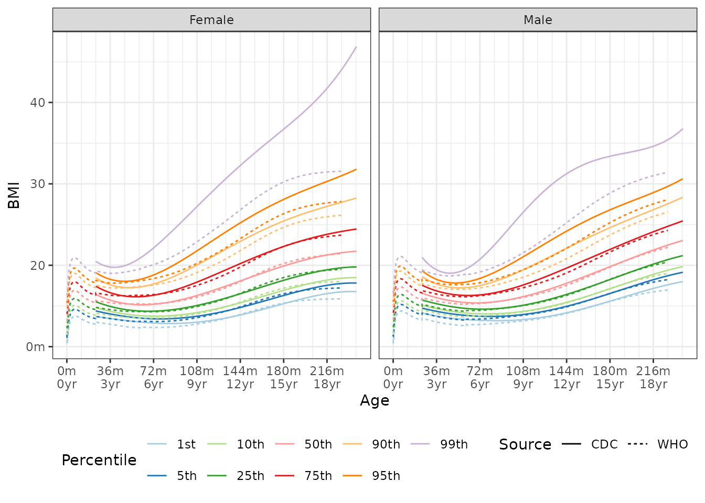
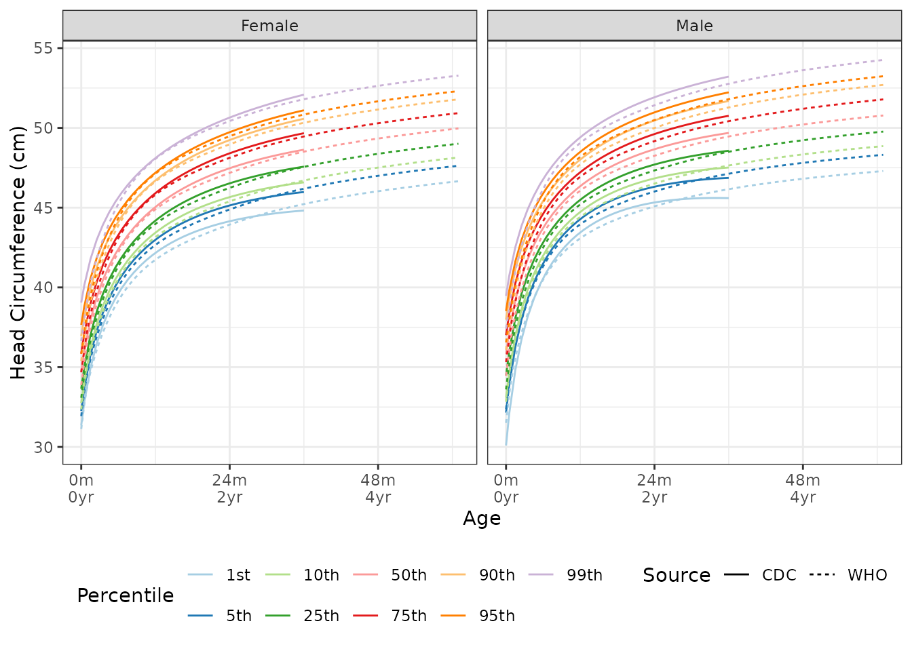
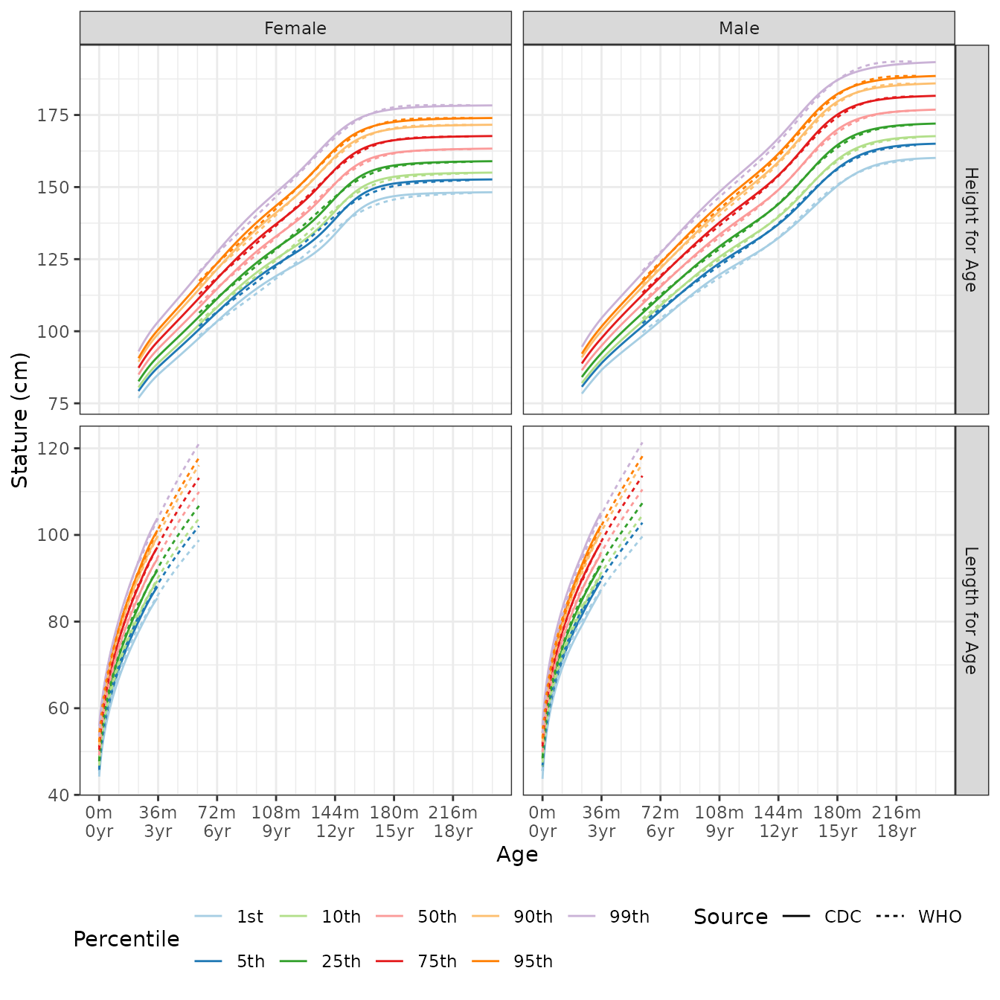
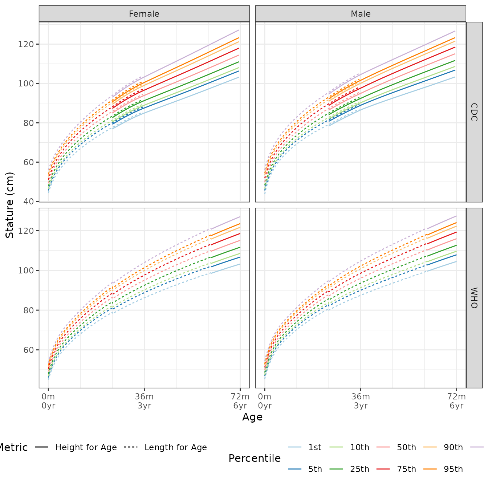
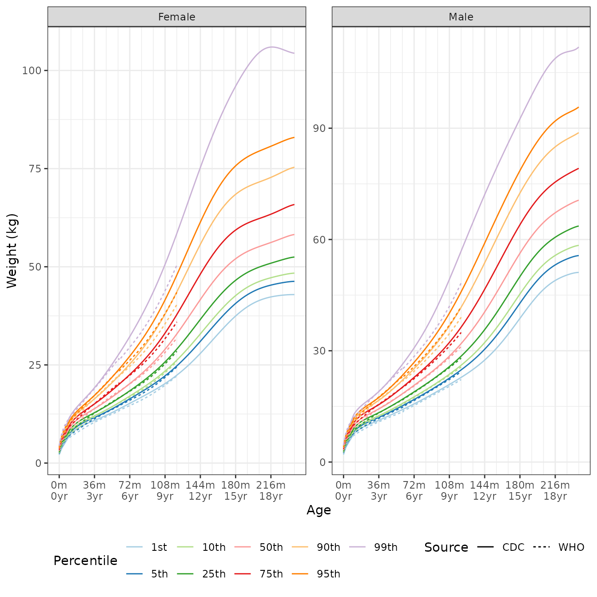
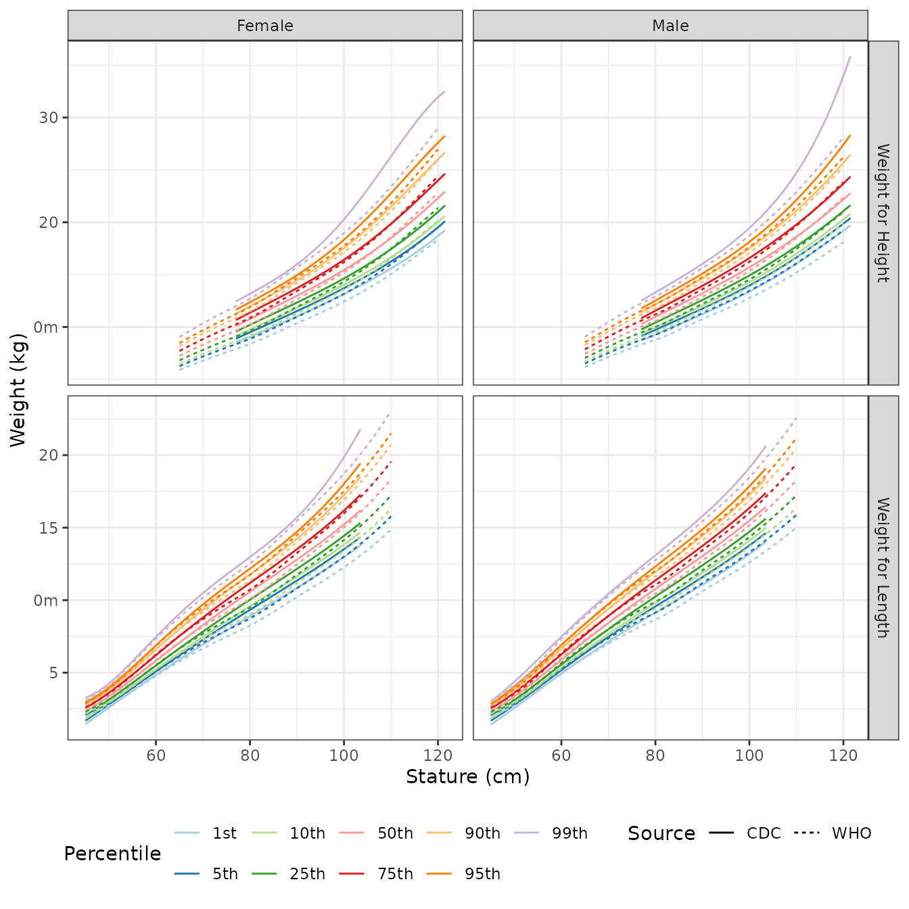

# Growth Standards

## Growth Charts

Using the [Percentile Data Files with LMS
values](https://www.cdc.gov/growthcharts/percentile_data_files.htm)
provided by the CDC, and [Child Growth
Standards](https://www.who.int/tools/child-growth-standards/standards)
provided by the World Health Organization (WHO), we provide tools for
finding quantiles, percentiles, or z-scores, for:

1.  BMI for age,
2.  head circumference for age,
3.  stature for age,
4.  weight for age, and 5, weight for stature.

All lengths/heights are in centimeters, ages in months, and weights in
kilograms. Stature is used to refer both height and length; Specific
methods are provided for each.

## Method - LMS

All methods use the published LMS parameters to define z-scores,
percentiles, and quantiles for skewed distributions. L is a $\lambda$
parameter, the Box-Cox transformation power; $M$ the median value, and
$S$ a generalized coefficient of variation. For a given percentile or
z-score, the corresponding physical measurement, $X,$ is defined as

$$X = \begin{cases}
{M(1 + \lambda SZ)^{\frac{1}{\lambda}}} & {\lambda \neq 0} \\
{M\exp(SZ)} & {\lambda = 0.}
\end{cases}$$

From this we can get the z-score for a given measurement $X:$

$$Z = \begin{cases}
\frac{\left( \frac{X}{M} \right)^{\lambda} - 1}{\lambda S} & {\lambda \neq 0} \\
\frac{\log\left( \frac{X}{M} \right)}{S} & {\lambda = 0.}
\end{cases}$$

Percentiles are determined using the standard normal distribution of
z-scores.

For all eight of the noted methods we provide a distribution function,
quantile function, and function that returns z-scores.

Arguments named `p` are probabilities on the 0 to 1 scale. When
percentiles are described in text, tables, or figures, they are
expressed as percentile points on the 0 to 100 scale.

## Growth Standards

All the growth standard functions have a quantile, percentile, and
z-scores version.

### BMI for Age



The median BMI quantile for a 48 month old female is:

``` r
q_bmi_for_age(p = 0.5, male = 0, age = 48) # default is CDC
## [1] 15.32168
q_bmi_for_age(p = 0.5, male = 0, age = 48, source = c("CDC", "WHO"))
## [1] 15.32168 15.26020
```

A BMI of 17.2 for a 149 month old male is in the following percentiles
by source:

``` r
p_bmi_for_age(q = 17.2, male = 1, age = 149, source = c("CDC", "WHO"))
## [1] 0.3533024 0.3787698
```

If you would prefer to have the z-score for a BMI of 17.2 for a 149
month old male is in the following percentiles by source:

``` r
z_bmi_for_age(q = 17.2, male = 1, age = 149, source = c("CDC", "WHO"))
## [1] -0.3764197 -0.3087132
```

### Head Circumference for Age



### Stature for Age

Stature is either height or length. Functions for both are provided.

The image below is the growth chart by data source and by height or
length.



The following image shows the difference in the quantile values between
height and length for the same age.



#### Length for Age

Length for age quantiles are found via `q_length_for_age`. For example,
the median length for a 1.5 year old male, based on CDC data is:

``` r
q_length_for_age(p = 0.5, age = 1.5 * 12, male = 1, source = "CDC")
## [1] 81.44384
```

A 90 cm long 28 month old female is in the 63th percentile:

``` r
p_length_for_age(q = 90, age = 28, male = 0, source = "CDC")
## [1] 0.628035
```

or the equivalent z-score:

``` r
z_length_for_age(q = 90, age = 28, male = 0, source = "CDC")
## [1] 0.3266536
```

#### Height for Age

Height for age quantiles are found via `q_height_for_age`. For example,
the median height for a 11 year old male, based on CDC data is:

``` r
q_height_for_age(p = 0.5, age = 11 * 12, male = 1, source = "CDC")
## [1] 143.3107
```

A 125 cm tall 108 month old female is in the 10th percentile:

``` r
p_height_for_age(q = 125, age = 108, male = 0, source = "CDC")
## [1] 0.1008541
```

or the equivalent z-score:

``` r
z_height_for_age(q = 125, age = 108, male = 0, source = "CDC")
## [1] -1.2767
```

### Weight for Age



Find the 80th quantile for 56 month old females

``` r
q_weight_for_age(p = 0.80, age = 56, male = 0, source = c("CDC", "WHO"))
## [1] 19.38674 19.84028
```

The percentiles for 42 kg 9 year old males:

``` r
p_weight_for_age(q = 42, age = 9 * 12, male = 1, source = c("CDC", "WHO"))
## [1] 0.9666286 0.9900309
z_weight_for_age(q = 42, age = 9 * 12, male = 1, source = c("CDC", "WHO"))
## [1] 1.833402 2.327507
```

### Weight for Stature



The 60th weight quantile for a 1.2 meter tall male is

``` r
q_weight_for_height(p = 0.60, male = 1, height = 120, source = "CDC")
## [1] 22.4941
q_weight_for_height(p = 0.60, male = 1, height = 120, source = "WHO")
## [1] 22.89542
```

There are slight differences in the quantiles for length and height

``` r
q_weight_for_length(p = 0.60, male = 1, length = 97, source = "CDC")
## [1] 14.88168
q_weight_for_height(p = 0.60, male = 1, height = 97, source = "WHO")
## [1] 14.85803
```

``` r
q_weight_for_length(p = 0.60, male = 1, length = 97, source = "CDC")
## [1] 14.88168
q_weight_for_length(p = 0.60, male = 1, length = 97, source = "WHO")
## [1] 14.6771
```

Percentiles and standard scores for a 14 kg, 88 cm tall/long male

``` r
p_weight_for_height(q = 14, male = 1, height = 88, source = "CDC")
## [1] 0.9003879
p_weight_for_height(q = 14, male = 1, height = 88, source = "WHO")
## [1] 0.9285045
p_weight_for_length(q = 14, male = 1, length = 88, source = "CDC")
## [1] 0.9277451
p_weight_for_length(q = 14, male = 1, length = 88, source = "WHO")
## [1] 0.9479553
```

Corresponding standard scores

``` r
z_weight_for_height(q = 14, male = 1, height = 88, source = "CDC")
## [1] 1.283765
z_weight_for_height(q = 14, male = 1, height = 88, source = "WHO")
## [1] 1.464743
z_weight_for_length(q = 14, male = 1, length = 88, source = "CDC")
## [1] 1.459201
z_weight_for_length(q = 14, male = 1, length = 88, source = "WHO")
## [1] 1.625343
```
