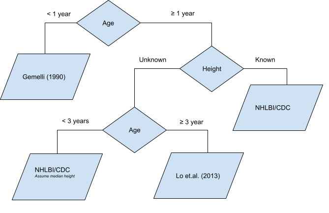

```{r label = "setup", include = FALSE}
knitr::opts_chunk$set(collapse = TRUE, fig.align = "center")
library(pedbp)
```


# Introduction

Part of the work of @martin2022machine required transforming blood
pressurement measurement into percentiles based on published norms.  This
work was complicated by the fact that data for pediatric blood pressure
precentiles is sparse and gennerally only applicable to children at least one
year of age and requires height, a commonly unavailable data point in
electronic health records for a variety of reasons.

A solution to building pediatric blood pressure percentiles was developed and
is presented here for others to use.  Inputs for the developed method are:

1. Patient sex (male/female) _required_
2. Systolic blood pressure (mmHg) _required_
3. Diastolic blood pressure (mmHg) _required_
4. Patient height (cm) _if known_.

Given the inputs the following logic is used to determine which data sets
will be used to inform the blood pressure percentiles.  Under one year of
age, the data from @gemelli1990longitudinal will be used; height is
irrelevent.  For those at least one year of age with a known height then the
NHLBI/CDC [@nhlbi2011expert] data sets are used.  If height is unknown and age is at least three
years then data from @lo2013prehypertension is used.  Lastly, under three
years of age with unknown height have blood pressure precentiles estimated by
the NHLBI/CDC data with the default of the median height for sex and age.



```{r echo = FALSE, results = "asis"}
cat(paste0("\n"))
```


# Estimating Pediatric Blood Distributions

There are two functions provided for working with blood pressure
distributions.  These methods uses Gausssian distributions for both systolic
and diastolic blood pressures with means and standard deviations either
explicitly from a aformentioned source or derived by optimizing the paramters
such that the sum of squared errors between the provided quantiles from a
aformentioned source and the distribution quantiles is minimized.  The
provided functions, a distribuiton function and a qunatile function, follow a
similar naming convention to the distribution functions found the stats
library in R.


```{r Distribution Function}
args(p_bp)

# Quantile Function
args(q_bp)
```


Both methods expect age in months, and an indicator for sex.  If height is
missing, e.g., NA, then the default higher percentile of 50 will will be used
as applicable.  The end user may modify the the default height percentile.

If height is entered, then the height percentile is determined via a LMS
method for age and sex and corresponding LMS data from the Centers for Disease Control and
Preventions (more infomation on LMS methods and data later in this vignette.)
The parameters for the blood pressure distriution are found in a look up
table using the nearest age and height percentile.

## Percentiles

What percentile for systolic and diastolic blood pressure is 100/60 for a 44
month old male with height unknown?


```{r }
p_bp(q_sbp = 100, q_dbp = 60, age = 44, male = 1)
```


Those percentiles would be modified if height was 183 cm:

```{r }
p_bp(q_sbp = 100, q_dbp = 60, age = 44, male = 1, height = 183)
```


What if you are guessing that the kid is extremely tall for his age and you'd
like to know the blood pressure percentiles assuming 90th percentile or
height?  First find the height quantile using the q_stature_for_age function:

```{r }
ht <- q_stature_for_age(p = 0.90, age = 44, male = 1)
ht
p_bp(q_sbp = 100, q_dbp = 60, age = 44, male = 1, height = ht)
```


Vectors of blood pressures can be used as well.  NA values will return and
NA.

```{r }
bps <- p_bp(q_sbp = c(100, NA, 90), q_dbp = c(60, 82, 48), age = 44, male = 1, height = ht)
bps
```


If you want to know where the estimates came from look at the bp_params
attribute:

```{r }
attr(bps, "bp_params")
str(bps)
```


## Quantiles
If you have percentile value and want to know the associated blood pressures:


```{r }
q_bp(p_sbp = c(0.701, NA, 0.36), p_dbp = c(0.85, 0.99, 0.50), age = 44, male = 1, height = ht)
```


# Blood Pressure Charts


## When Height is Unknown or Irrelvent

The following graphic shows the percentile curves by age and sex when height
is unknown, or irrelevent (for those under 12 months of age).


```{r label = "chart1_setup", echo = FALSE}
d <- data.table::CJ(male = 0:1
                    , age = unique(bp_parameters$age)
                    , bp_percentile = c(5, 10, 25, 50, 75, 90, 95) / 100)

d <- d[, as.list(q_bp(bp_percentile, bp_percentile, age, male))
       , by = .(male, age, bp_percentile)]

d <- data.table::melt(d
                      , id.vars = c("male", "age", "bp_percentile")
                      , measure.vars = c("sbp", "dbp")
                      )
d[, variable := factor(variable, c("sbp", "dbp"), c("Systolic", "Diastolic"))]
d[, plab := paste0(bp_percentile * 100, "%")]

g <- function(d) {
  ggplot2::ggplot(d) +
  ggplot2::aes(x = age, y = value, linetype = variable, color = factor(bp_percentile)) +
  ggplot2::geom_line() +
  ggrepel::geom_label_repel(data = function(x) {subset(x, x$age == max(x$age))}
                            , ggplot2::aes(label = plab)
                            , size = 3
                            , nudge_x = 3
                            , nudge_y = 1
                            , arrow = ggplot2::arrow(length = ggplot2::unit(0.01, "npc"))
                            , alpha = 0.8
                            , na.rm = TRUE) +
  ggplot2::facet_grid( ~ factor(male, 0:1, c("Female", "Male"))) +
  ggplot2::scale_x_continuous(name = "Age"
                              , breaks = seq(0, max(d$age) + 12, by = 12)
                              , labels = paste(
                                                 paste0(seq(0, max(d$age) + 12, by = 12), "m")
                                               , paste0(seq(0, max(d$age) + 12, by = 12) / 12, "yr")
                                               , sep = "\n")
                              , limits = c(0, 220)
                              ) +
  ggplot2::scale_y_continuous(name = "mmHg",breaks=c(0, 30, 60, 90, 120), limits = c(15, 140)) +
  ggplot2::guides(color = "none") +
  ggplot2::theme(
                 legend.position = "bottom"
                 , legend.title = ggplot2::element_blank()
                 , plot.title = ggplot2::element_text(size = 16, face = "bold")
                 # , axis.text = ggplot2::element_text(size = 14, face = "bold")
                 , axis.title = ggplot2::element_text(size = 16, face = "bold")
                 )
}
```


```{r label = "chart1_female", echo = FALSE, fig.width = 8, fig.height = 6}
g(d[male == 0])
```


```{r label = "chart1_male", echo = FALSE, fig.width = 8, fig.height = 6}
g(d[male == 1])
```


## Median Blood Pressures -- Varying default height percentile

If height is unknown there will be no difference in the estimated percentile
for blood pressures when modifying the default height_percentile with the
exception of values for patients between the ages of 12 and 36 months.
Younger patients have percentile estimated by data from
@gemelli1990longitudinal which does not consider height (length), and for
patients over 36 months of age data from @lo2013prehypertension, which also
does not account for height, is used.

The following graphic shows the median blood pressure in mmHg by age when
variying the default height percentile used.  The colors refer to the height
percentile.


```{r label = "chart2_setup", echo = FALSE}
d <- data.table::CJ(male = 0:1
                    , age = unique(bp_parameters$age)
                    , bp_percentile = 50 / 100
                    , height_percentile = unique(na.omit(bp_parameters$height_percentile)) / 100)
d <- d[, as.list(q_bp(bp_percentile, bp_percentile, age, male, height_percentile = height_percentile))
       , by = .(male, age, bp_percentile, height_percentile)]

d <- data.table::melt(d
                      , id.vars = c("male", "age", "bp_percentile","height_percentile")
                      , measure.vars = c("sbp", "dbp")
                      )
d[, variable := factor(variable, c("sbp", "dbp"), c("Systolic", "Diastolic"))]
d[, hlab := paste0(height_percentile * 100, "%")]

g <- function(d) {
ggplot2::ggplot(d[d$age <= 84, ]) +
  ggplot2::aes(x = age, y = value, linetype = variable, color = factor(height_percentile)) +
  ggplot2::geom_line() +
  ggrepel::geom_label_repel(data = function(x) {subset(x, x$age == 24)}
                            , ggplot2::aes(label = hlab)
                            , size = 3
                            , nudge_x = 23
                            , nudge_y = -11
                            , arrow = ggplot2::arrow(length = ggplot2::unit(0.01, "npc"))
                            , alpha = 0.8
                            , na.rm = TRUE) +
  ggplot2::facet_grid( ~ factor(male, 0:1, c("Female", "Male"))) +
  ggplot2::scale_x_continuous(name = "Age"
                              , breaks = seq(0, 84, by = 12)
                              , labels = paste(
                                                 paste0(seq(0, 84, by = 12), "m")
                                               , paste0(seq(0, 84, by = 12) / 12, "yr")
                                               , sep = "\n")
                              , limits = c(0, 84)
                              ) +
  ggplot2::scale_y_continuous(name = "Median BP (mmHg)",breaks=c(0, 30, 60, 90, 120), limits = c(15, 140)) +
  ggplot2::guides(color = "none") +
  ggplot2::theme(
                 legend.position = "bottom"
                 , legend.title = ggplot2::element_blank()
                 , plot.title = ggplot2::element_text(size = 16, face = "bold")
                 # , axis.text = ggplot2::element_text(size = 14, face = "bold")
                 , axis.title = ggplot2::element_text(size = 16, face = "bold")
                 )
}
```


```{r label = "chart2_female", echo = FALSE, fig.width = 8, fig.height = 6}
g(d[male == 0])
```


```{r label = "chart2_male", echo = FALSE, fig.width = 8, fig.height = 6}
g(d[male == 1])
```


## Median Blood Pressures with Known Heights

The following chart shows the median blood pressure by age for differnt
heights based on percentiles for age.


```{r label = "chart3", echo = FALSE, fig.width = 12, fig.height = 6}
d <- data.table::CJ(male = 0:1
                    , age = unique(bp_parameters$age)
                    , bp_percentile = 50 / 100
                    , height_percentile = unique(na.omit(bp_parameters$height_percentile)) / 100)

d[, height := NA_real_]
d[age < 36, height := q_length_for_age_inf(height_percentile, age, male), by = .(male, age, height_percentile)]
d[age >= 36, height := q_stature_for_age(height_percentile, age, male), by = .(male, age, height_percentile)]

d <- d[, as.list(q_bp(bp_percentile, bp_percentile, age, male, height))
       , by = .(male, age, bp_percentile, height_percentile)]

d <- data.table::melt(d
                      , id.vars = c("male", "age", "bp_percentile","height_percentile")
                      , measure.vars = c("sbp", "dbp")
                      )
d[, variable := factor(variable, c("sbp", "dbp"), c("Systolic", "Diastolic"))]
d[, hlab := paste0(height_percentile * 100, "%")]

g <- function(d) {
  ggplot2::ggplot(d) +
  ggplot2::aes(x = age, y = value, linetype = variable, color = factor(height_percentile)) +
  ggplot2::geom_line() +
  ggrepel::geom_label_repel(data = function(x) {subset(x, x$age == max(x$age))}
                            , ggplot2::aes(label = hlab)
                            , size = 3
                            , nudge_x = 23
                            , nudge_y = -11
                            , arrow = ggplot2::arrow(length = ggplot2::unit(0.01, "npc"))
                            , alpha = 0.8
                            , na.rm = TRUE) +
  ggplot2::facet_grid( ~ factor(male, 0:1, c("Female", "Male"))) +
  ggplot2::scale_x_continuous(name = "Age"
                              , breaks = seq(0, max(d$age) + 12, by = 12)
                              , labels = paste(
                                                 paste0(seq(0, max(d$age) + 12, by = 12), "m")
                                               , paste0(seq(0, max(d$age) + 12, by = 12) / 12, "yr")
                                               , sep = "\n")
                              , limits = c(0, max(d$age) + 12)
                              ) +
  ggplot2::scale_y_continuous(name = "Median BP (mmHg)",breaks=c(0, 30, 60, 90, 120), limits = c(15, 140)) +
  ggplot2::guides(color = "none") +
  ggplot2::theme(
                 legend.position = "bottom"
                 , legend.title = ggplot2::element_blank()
                 , plot.title = ggplot2::element_text(size = 16, face = "bold")
                 # , axis.text = ggplot2::element_text(size = 14, face = "bold")
                 , axis.title = ggplot2::element_text(size = 16, face = "bold")
                 )
}
```


```{r label = "chart3_female", echo = FALSE, fig.width = 8, fig.height = 6}
g(d[male == 0])
```


```{r label = "chart3_male", echo = FALSE, fig.width = 8, fig.height = 6}
g(d[male == 1])
```


# CDC Growth Charts


```{r label = 'lms_data_table', include = FALSE}
lms <- data.table::setDT(data.table::copy(pedbp:::cdc_lms_data))
```


Using the [Percentile Data Files with LMS values](https://www.cdc.gov/growthcharts/percentile_data_files.htm)
provided by the CDC, we provide eight distribution tools.

1. weight for age infant
2. length for age infant
3. weight for length infant
4. head circumference for age
5. weight for stature
6. weight for age
7. stature for age
8. bmi for age

All lengths/heights are in centimeters, age in months, weight in kilograms.

The length-for-age and stature-for-age methods were needed for the blood
pressure methods above.

All the methods use the publisedh LMS parameters to defined z-scores,
percentiles, and quantiles for skewed distribuitons.  L is a $\lambda$
parameter, the Box-Cox transformation power; $M$ the median value, and $S$ a
generalized coefficient of variation.  For a given percentile or z-score, the
coresponding physical measurement, $X,$ is defined as

$$X = \begin{cases}
   M \left(1 + \lambda S Z \right)^{\frac{1}{\lambda}} & \lambda \neq 0 \\
   M \exp\left( S Z \right) & \lambda = 0.
\end{cases}$$

From this we can get the z-score for a given measurement $X:$

$$ Z = \begin{cases}
  \frac{\left(\frac{X}{M}\right)^{\lambda} - 1}{\lambda S} & \lambda \neq 0 \\
  \frac{\log\left(\frac{X}{M}\right) }{ S } & \lambda = 0.
  \end{cases}$$

Percentiles are found from the standard normal distribuiton of z-scores.

For all eight of the noted methods we provide a distribuiton function,
quantile function, and function that returns z-scores.

## Length and Sature For Age

Example of building a length/height for age chart:

```{r echo = FALSE}
lfa <- data.table::CJ(p = c(0.01, 0.05, 0.10, 0.25, 0.50, 0.75, 0.90, 0.95, 0.99),
                      age = seq(0, 18*12, by = 3),
                      male = 0:1)

lfa[age <  36, l := q_length_for_age_inf(p, age, male), by = .(p, age, male)]
lfa[age >= 36, l := q_stature_for_age(p, age, male), by = .(p, age, male)]
lfa[, lab := paste(p * 100, "%")]
lfa[, male := factor(male, 0:1, c("Female", "Male"))]

g <- function(lfa) {
  ggplot2::ggplot(lfa) +
  ggplot2::aes(x = age, y = l, color = factor(p)) +
  ggplot2::geom_line() +
  ggplot2::facet_wrap( ~ male) +
  ggrepel::geom_label_repel(data = function(x) {subset(x, x$age == max(x$age))}
                            , ggplot2::aes(label = lab)
                            , size = 3
                            , nudge_x = 23
                            , nudge_y = 5
                            , arrow = ggplot2::arrow(length = ggplot2::unit(0.01, "npc"))
                            , alpha = 0.8
                            , na.rm = TRUE) +
  ggplot2::scale_x_continuous(name = "Age"
                              , breaks = seq(0, max(lfa$age) + 12, by = 12)
                              , labels = paste(
                                                 paste0(seq(0, max(lfa$age) + 12, by = 12), "m")
                                               , paste0(seq(0, max(lfa$age) + 12, by = 12) / 12, "yr")
                                               , sep = "\n")
                              , limits = c(0, max(lfa$age) + 12)
                              ) +
  ggplot2::scale_y_continuous(name = "Length or Height (cm)") +
  ggplot2::guides(color = "none") +
  ggplot2::theme(
                 legend.position = "bottom"
                 , legend.title = ggplot2::element_blank()
                 , plot.title = ggplot2::element_text(size = 16, face = "bold")
                 , axis.title = ggplot2::element_text(size = 16, face = "bold")
                 )
}
```


```{r label = "lfa_female", echo = FALSE, fig.width = 8, fig.height = 6}
g(lfa[male == "Female"])
```


```{r label = "lfa_male", echo = FALSE, fig.width = 8, fig.height = 6}
g(lfa[male == "Male"])
```


# Additional Utilities

## Estimating Gausssian Mean and Standard Deviation

The NHLBI data for blood pressures provided values in percentiles.  To get a
mean and standard deviation that would work well for estimating other
percentiles and quantiles via a Gausssian distriution we optimized for values
of the mean and standard deviation such that for the provided quantiles $q_i$
at the $p_i$ percentiles and $X \sim N\left(\mu, \sigma\right)$,

$$ \sum_{i} \left(\Pr(X \leq q_i) - p_i \right)^2, $$

was minimized.  The NHLBI data is provided to the end user.

```{r }
data(list = "nhlbi_bp_norms", package = "pedbp")
str(nhlbi_bp_norms)
```


For an example of how we fitted the parameters:

```{r }
d <- nhlbi_bp_norms[nhlbi_bp_norms$age == 144 & nhlbi_bp_norms$height_percentile == 50, ]
d <- d[d$male == 0, ]
d

est_norm(q = d$sbp, p = d$bp_percentile / 100)
est_norm(q = d$dbp, p = d$bp_percentile / 100)

bp_parameters[bp_parameters$male == 0 & bp_parameters$age == 144 & bp_parameters$height_percentile == 50, ]
```


The est_norm method comes with a plotting method too.  The provided quantiles
are plotted as open dots and the fitted distriution function is plotted to
show the fit.

```{r }
plot( est_norm(q = d$dbp, p = d$bp_percentile / 100) )
```


If you want to emphasize a data point you can do that as well.  Here is an
example from a set of quantiles and percentiles which are not Gausssian.


```{r }
qs <- c(-1.92, 0.05, 0.1, 1.89) * 1.8 + 3.14
ps <- c(0.025, 0.40, 0.50, 0.975)

# with equal weights
w0 <- est_norm(qs, ps)
# weight to ignore one of the middle value and make sure to hit the other
w1 <- est_norm(qs, ps, weights = c(1, 2, 0, 1))
# equal weight the middle, more than the tails
w2 <- est_norm(qs, ps, weights = c(1, 2, 2, 1))
```


```{r label = "est_norm_plots", fig.width = 6, fig.height = 4}
par(mfrow = c(1, 3))
plot(w0, main = paste0("w0\nMean: ", round(w0$par[1], 2), " SD: ", round(w0$par[2], 3)))
plot(w1, main = paste0("w1\nMean: ", round(w1$par[1], 2), " SD: ", round(w1$par[2], 3)))
plot(w2, main = paste0("w2\nMean: ", round(w2$par[1], 2), " SD: ", round(w2$par[2], 3)))
```


# References
<div id="refs"></div>

# Session Info

```{r label = "sessioninfo"}
sessionInfo()
```

